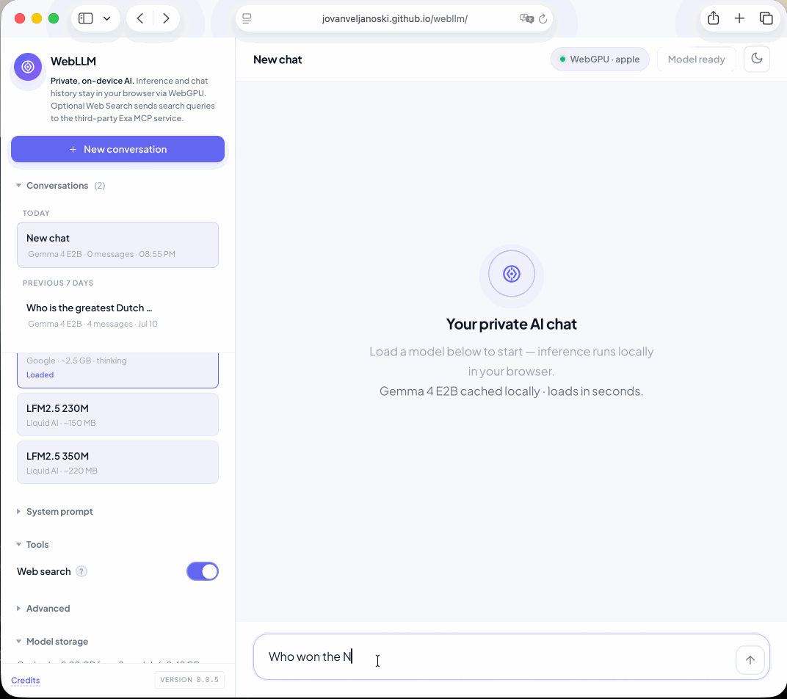

# WebLLM

Private, on-device AI with an agent loop that runs in the browser.

**[Try the live demo](https://jovanveljanoski.github.io/webllm/)**



WebLLM is a proof of concept: can a useful model load from a static website, reason,
call a tool, inspect the result, and continue its work without an account, API key,
backend, or local installation?

Today, the answer is yes—with the limits of today's small on-device models. Models
will improve, and the harness can improve with them. This project is step zero: a
small, inspectable implementation of agentic work on private local inference.

## What works today

- Local inference through WebGPU
- Gemma 4 E2B with thinking and tool use
- Smaller LFM2.5 230M and 350M models with tool use
- A bounded model → tool → model agent loop
- Optional web search through Exa MCP, with no API key
- Local conversation history and model caching
- Editable system prompts and prompt-guided JSON or EBNF output
- OpenAI-compatible conversation exports and detailed debug traces

The production app is static HTML and JavaScript. There is no application server
and no build step.

## Try it

Use Chrome 113+, Edge 113+, or Safari 18+. Firefox is not supported by the current
WebGPU runtimes.

1. Open the [live demo](https://jovanveljanoski.github.io/webllm/).
2. Choose a model in the sidebar.
3. Select **Load model**.
4. Wait for the first download and warm-up, then send a message.
5. Enable **Web search** to use the agent loop with any supported model.

The first load downloads model weights from Hugging Face. Gemma is about 2.5 GB;
the LFM models are about 150 MB and 220 MB. The browser caches them for later
visits when storage is available.

No account or API key is required. “Zero setup” still means that the browser must
support WebGPU, have enough storage, and download a model once.

## How the agent loop works

The loop is deliberately conventional. The model does not directly call JavaScript
or access the network. It emits structured text asking for a declared tool; the
harness parses that request, runs the matching function, records its output as a
tool message, and asks the model to continue.

```text
user message
    ↓
assemble system prompt + transcript + tool definitions
    ↓
local model generation
    ├─ final answer ──────────────────────────────→ save and render
    └─ tool call
          ↓
       validate and execute registered tool
          ↓
       append assistant tool call + tool result
          ↓
       local model generation resumes
```

For one agent turn:

1. `app.js` adds the user's message to the current session.
2. `lib/messages.js` builds the effective model transcript.
3. `lib/agent-loop.js` asks the model adapter for a generation.
4. The adapter selected by `lib/runtime-registry.js` translates canonical messages
   and normalizes that runtime's output.
5. If there is no tool call, the answer is complete.
6. If there is a tool call, the loop resolves it against the tool registry and
   executes it. Unknown tools and execution failures become tool-result messages,
   so the model can see what happened.
7. The assistant tool call and matching tool result are appended to the transcript,
   then generation runs again.
8. The resulting canonical messages are saved to IndexedDB and rendered by the UI.

The UI currently registers one tool, `web_search`. The loop itself is
model- and tool-agnostic: tools provide a name, schema, execution function, prompt
policy, trust level, and whether concurrent execution is safe.

### What is inserted where

The stored session contains:

- the editable system prompt;
- chronological `user`, `assistant`, and `tool` messages;
- thinking and generation metrics on assistant messages;
- tool call IDs and execution metadata.

The stored system prompt defaults to:

```text
You are a helpful assistant.
```

Immediately before a model call, the app creates an effective system message. It
does not rewrite the stored prompt. The layers are added in this order:

1. The session's system prompt.
2. The fixed January 2025 knowledge cutoff and the browser's current local date.
3. In agent mode, the tool-call protocol.
4. Policies contributed by active tools, such as when and how to search.
5. A guard telling the model to treat external tool output as evidence, never as
   instructions.
6. In ordinary chat mode, optional JSON or EBNF guidance.

Active tool schemas are supplied through the selected runtime adapter. Tool policy
is rebuilt before every generation, so the final tools-disabled generation does
not retain stale tool-use instructions. Web search and grammar guidance are
mutually exclusive in the current UI.

Before generation, the loaded model's tokenizer measures the complete prompt. The
input budget reserves the requested output length plus 256 safety tokens. If the
conversation is too large, the harness removes the oldest complete user turns. It
never splits an assistant tool call from its tool result and never shortens the
current turn. If the current turn alone does not fit, generation fails visibly.

### Boundaries and stopping rules

Agent execution is bounded so a small model cannot search forever:

- At most three tool rounds
- At most four calls from one generation
- At most eight calls in one user turn
- One final generation with tools disabled after the tool-round limit

Calls execute sequentially unless every requested tool explicitly declares itself
parallel-safe. `web_search` is parallel-safe. Stopping a response propagates an
`AbortSignal` through model generation and search, and partial state is preserved.

Tool calls are only executed after the parser finds a complete, balanced call.
Calls inside an open thinking channel and truncated calls are ignored. This avoids
executing half-generated arguments.

### Web search, end to end

When Web Search is enabled, the effective prompt tells the model when to search and
how to write focused queries. A call can contain up to three queries. The search
tool:

1. normalizes and deduplicates queries for that user turn;
2. sends them to the public Exa MCP endpoint;
3. requests up to three results per query;
4. sanitizes and formats the returned evidence;
5. gives the same evidence to the UI and the local model.

The selected model then generates again with the full search result in its
transcript. It may answer, make another search within the limits, or report that
the evidence is insufficient. The host does not truncate provider evidence,
classify answer quality, retry weak answers, or invent a result.

## Privacy and network access

Prompts, generations, and chat history stay in the browser when Web Search is off.
Inference always runs locally.

There are two intentional network paths:

- Model files are downloaded from Hugging Face and cached locally.
- When Web Search is enabled, normalized queries are sent to the third-party Exa
  MCP service and results return to the browser.

Search queries therefore are not private to the device. Search results are treated
as untrusted external data before being shown to the model.

Sessions live in the `webllm-sessions` IndexedDB database. Preferences and theme
live in `localStorage`. Model weights use IndexedDB and/or Cache Storage depending
on the runtime. Storage failures degrade to in-memory chat where possible.

## Models

- **Gemma 4 E2B** — default, about 2.5 GB, thinking and `web_search`
- **LFM2.5 230M** — about 150 MB, fastest, native LFM tool calling
- **LFM2.5 350M** — about 220 MB, a larger LFM option with native tool calling

Gemma 4 E4B is not loadable by the app.

## Design decisions

**Browser first.** A static site is the shortest path from a link to private local
inference. It also makes the runtime boundary easy to inspect: the browser is the
application.

**A transcript, not hidden state.** Tool requests and results are ordinary
chronological messages. This makes sessions portable, debuggable, and exportable.

**A small generic loop.** The orchestration code knows how to generate, dispatch
tools, append results, and stop. Search-specific behavior stays in the search tool;
runtime-specific syntax and generation behavior stay behind the runtime registry.

**Bounded autonomy.** Hard round and call limits are more predictable than asking a
small model to decide when it has done enough.

**Visible failure.** Incomplete calls are not executed, tool errors go back into the
transcript, and oversized current turns fail rather than silently losing content.

**No host-side answer judge.** The harness currently accepts the model's final
answer. There is no evaluator, retry loop, memory summarizer, planner, or background
worker. Those are possible future improvements, not behavior hidden in the demo.

## Current limitations

- Web search is the only tool wired into the UI.
- Agent quality is constrained by a small local model and its tool-call reliability.
- Grammar mode is prompt guidance, not token-level constrained decoding.
- The model must remain loaded in the active page; there is no background runtime.
- Unit tests do not run real WebGPU inference.

This is a proof of concept, not a security boundary for executing arbitrary tools.
Any new tool should validate its inputs, define its output contract and trust
level, and expose only the minimum capability needed.

## Local development

Clone the repository and serve it over HTTP:

```bash
make run
```

Then open [http://localhost:8080](http://localhost:8080). Do not open `index.html`
through `file://`; normal model caching and persistence require an HTTP(S) origin.

There is no production build. Development dependencies are used only for linting
and tests:

```bash
make install
make lint
make test
```

`make ci` runs the same install, lint, and test sequence used by GitHub Actions.
Node.js 22 is used in CI.

## Project structure

- `index.html` — document shell and styles
- `app.js` — UI state, model lifecycle, streaming, persistence, and orchestration
- `lib/agent-loop.js` — bounded model/tool transcript loop
- `lib/messages.js` — effective prompt construction and exports
- `lib/runtime-registry.js` — runtime loading, token counting, generation options,
  tool protocol, and adapter selection
- `lib/gemma-adapter.js` — canonical-message and Gemma protocol boundary
- `lib/lfm-adapter.js` — canonical-message and LFM protocol boundary
- `lib/tools.js` — tool declarations and prompt policies
- `lib/web-search-tool.js` — query handling and search execution
- `lib/` — testable browser-independent application logic
- `gemma-4-e2b.js` and `lfm2_5.js` — vendored WebGPU runtimes
- `tests/` — Vitest unit tests
- `docs/architecture.md` — detailed source of truth for current behavior

## Contributing

Keep changes small and the production surface simple: vanilla JavaScript, static
assets, and testable logic in `lib/`. Run `make lint` and `make test` for every
change. Update this README and `docs/architecture.md` when the agent loop, prompt
layers, persistence, model registry, or privacy boundary changes.

Real inference is not covered by the unit suite, so runtime changes should also be
smoke-tested in a supported browser over HTTPS.

## Credits

WebLLM builds on the Hugging Face and Transformers.js ecosystem, including the
browser ML work of [Joshua Lochner](https://github.com/Xenova). The LFM runtime is
based on
[webml-community/lfm2-webgpu-kernels](https://huggingface.co/spaces/webml-community/lfm2-webgpu-kernels).
The bounded inner-turn design is informed by [pi.dev](https://pi.dev/).

## License

MIT
