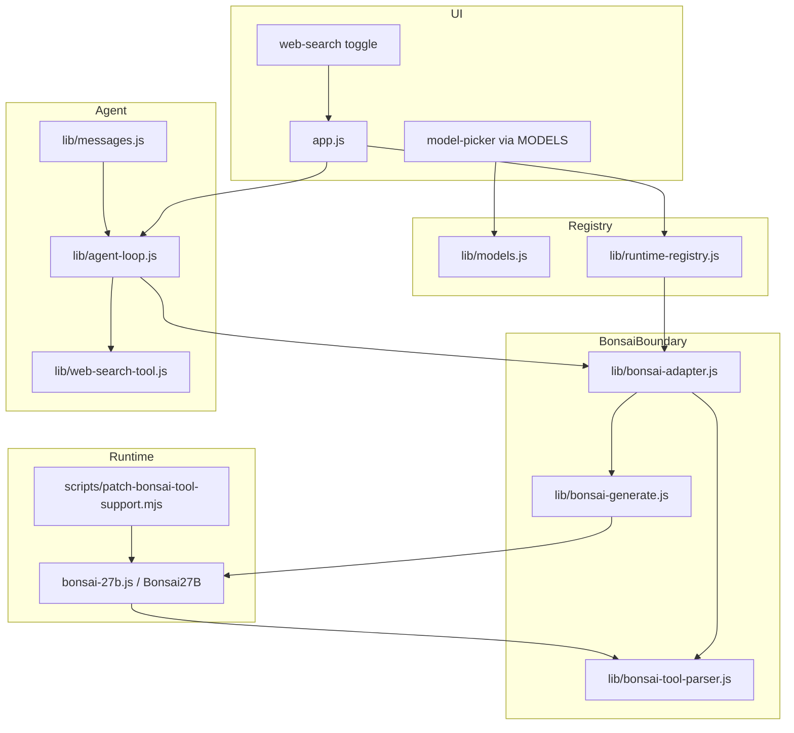

# Bonsai 27B Integration — Design & Implementation Plan

**Status:** Phase 3 implemented — browser smoke for web search pending  
**Author:** WebLLM maintainers  
**Last updated:** 2026-07-16  

This document captures research findings, architectural decisions, and a phased
implementation plan for adding **Bonsai 27B** to WebLLM. It is intended for
external reviewers who may approve the approach, contribute patches, or help
validate runtime behavior in-browser.

---

## Table of contents

1. [Executive summary](#executive-summary)
2. [References](#references)
3. [Goals & non-goals](#goals--non-goals)
4. [Current WebLLM state](#current-webllm-state)
5. [Bonsai runtime findings](#bonsai-runtime-findings)
6. [Comparison: Bonsai vs Gemma vs LFM](#comparison-bonsai-vs-gemma-vs-lfm)
7. [Integration architecture](#integration-architecture)
8. [Phased implementation plan](#phased-implementation-plan)
9. [Tool support (web_search)](#tool-support-web_search)
10. [Open decisions](#open-decisions)
11. [Risks & mitigations](#risks--mitigations)
12. [File change summary](#file-change-summary)
13. [Smoke test checklist](#smoke-test-checklist)
14. [Implementation checklist](#implementation-checklist)
15. [Implementation log](#implementation-log)

---

## Executive summary

**Bonsai 27B** is a 1-bit quantized (~3.9 GB) 27B-class language model from
Prism ML, derived from Qwen3.6-27B. A browser WebGPU runtime is published as a
single-file Hugging Face Space:

- [webml-community/bonsai-webgpu-kernels](https://huggingface.co/spaces/webml-community/bonsai-webgpu-kernels)

Model weights:

- [prism-ml/Bonsai-27B-gguf](https://huggingface.co/prism-ml/Bonsai-27B-gguf)
  — `Bonsai-27B-Q1_0.gguf` (~3.9 GB)

**WebLLM today has no Bonsai integration.** The closest existing pattern is
**Gemma 4 E2B**: vendored Xenova WebGPU bundle + runtime adapter + optional
patch script + agent-loop boundary. Bonsai shares the same runtime *family*
(Xenova `com.xenova.*` ops, embedded WGSL, browser-local inference) but uses
GGUF weights (like LFM) and Qwen3.6 chat/tool protocols (unlike Gemma).

**Proposed UI order** (model picker):

1. Gemma 4 E2B *(default, unchanged)*
2. **Bonsai 27B** *(new)*
3. LFM2.5 230M
4. LFM2.5 350M

Picker order is driven by object insertion order in `lib/models.js`; no
`app.js` picker changes are required.

**Recommended delivery:** four phases as an **implementation order** within a
single feature branch — (1) vendoring + load + chat + thinking, (2) runtime patch,
(3) web_search tools, (4) polish. One PR when complete and smoke-tested.

---

## References

| Resource | URL | Notes |
|----------|-----|-------|
| WebGPU runtime (HF Space) | https://huggingface.co/spaces/webml-community/bonsai-webgpu-kernels | Single ~814 KB `index.html`; runtime + demo UI |
| Model weights (GGUF) | https://huggingface.co/prism-ml/Bonsai-27B-gguf | `Bonsai-27B-Q1_0.gguf`, Apache 2.0, assumed public (same as Gemma) |
| Model README / benchmarks | https://huggingface.co/prism-ml/Bonsai-27B-gguf/raw/main/README.md | Memory tables, generation params, BFCL scores |
| Base architecture | https://huggingface.co/Qwen/Qwen3.6-27B | Hybrid attention, ChatML template, tool format |
| Qwen chat template | https://huggingface.co/Qwen/Qwen3.6-27B/blob/main/chat_template.jinja | XML tool-call format definition |
| Qwen function calling docs | https://qwen.readthedocs.io/en/latest/framework/function_call.html | Hermes/XML-style tool use |
| Qwen3.6 tool format drift issue | https://github.com/QwenLM/Qwen3.6/issues/178 | Stray `</function_invocation>` tags |
| WebLLM Gemma runtime (analogue) | https://huggingface.co/spaces/webml-community/gemma-4-webgpu-kernels | Same Xenova bundle pattern |
| WebLLM architecture doc | `docs/architecture.md` | Current source of truth |

---

## Goals & non-goals

### Goals

- Add Bonsai 27B as a selectable model **below Gemma, above LFM** models.
- Reuse the existing runtime-adapter pattern (`lib/runtime-registry.js`).
- Support **thinking mode** infrastructure (Qwen redacted-thinking channels) — **disabled
  at runtime for v1**; re-enable via `supportsThinking` + `enable_thinking` when ready.
- Support **web_search** tool via the existing agent loop (`lib/agent-loop.js`).
- Use existing GGUF cache infrastructure (`lib/cache.js`, `cacheType: "gguf"`).
- Keep changes testable: unit tests for adapter, parser, patch; manual smoke
  tests for real inference.

### Non-goals (initial release)

- Multimodal / vision tower (~0.63 GB mmproj) — text-only for now.
- DSpark speculative-decoding drafter layer — optional future optimization.
- Full 262K context in browser — start with a conservative cap.
- Changing the default model away from Gemma 4 E2B.
- Server-side inference or backend changes.

---

## Current WebLLM state

### Model registry (`lib/models.js`)

| ID | Name | Runtime | Weights | Size | Thinking | Tools |
|----|------|---------|---------|------|----------|-------|
| `gemma4` | Gemma 4 E2B | `gemma` | safetensors | ~2.5 GB | ✅ | ✅ |
| `bonsai27b` | Bonsai 27B | `bonsai` | GGUF Q1_0 | ~3.9 GB | ❌ (v1) | ❌ (Phase 3) |
| `lfm2` | LFM2.5 230M | `lfm2` | GGUF | ~150 MB | ❌ | ✅ |
| `lfm2_350` | LFM2.5 350M | `lfm2` | GGUF | ~220 MB | ❌ | ✅ |

Default model: `gemma4` (`lib/constants.js` → `DEFAULT_MODEL_ID`).

### Integration pattern (Gemma — template to follow)

```
Canonical messages (OpenAI-ish)
        ↓ toGemmaMessage()
Gemma runtime shape
        ↓ model.generate() [patched bundle]
Raw text (thinking + tool syntax)
        ↓ parseGemmaToolOutput()
Normalized assistant message { content, thinking, tool_calls }
        ↓
lib/agent-loop.js (runtime-agnostic)
```

Key files:

- `gemma-4-e2b.js` — vendored WebGPU bundle → `globalThis.Gemma4Mobile`
- `lib/gemma-adapter.js` — message mapping, generation, tool protocol string
- `lib/gemma-generate.js` — stream collection, prefill/decode metrics
- `lib/tool-parser.js` + `lib/tool-call-syntax.js` — Gemma tool syntax
- `scripts/patch-gemma-tool-support.mjs` — reproducible upstream patch
- `lib/runtime-registry.js` — single dispatch point

### Bonsai references in repo today

**None**, except an incidental string `bonsai-pipeline-v1` inside the vendored
Gemma bundle (shared Xenova Cache Storage naming — not an integration).

---

## Bonsai runtime findings

Source: analysis of
[webml-community/bonsai-webgpu-kernels](https://huggingface.co/spaces/webml-community/bonsai-webgpu-kernels)
`index.html` and [prism-ml/Bonsai-27B-gguf](https://huggingface.co/prism-ml/Bonsai-27B-gguf)
README.

### What the HF Space is

- A **static, all-in-one browser demo** — not Transformers.js, not ONNX, not
  WebLLM's previous stack.
- The repo contains only `index.html` (~814 KB), `README.md`, `.gitattributes`.
- Inference, GGUF parsing, tokenizer, Jinja chat templating, and ~130 WGSL
  compute kernels are **bundled inline** in `index.html`.

### Runtime entrypoint

| API | Detail |
|-----|--------|
| Class | `Bonsai27B` (exported to `globalThis`) |
| Load | `Bonsai27B.load(hubId, options)` |
| Generate | `async *generate(messages, options)` |
| Availability | `Bonsai27B.checkAvailability()` — WebGPU + VRAM probe |
| Warmup | Internal kernel warmup during `load()`; WebLLM does **not** call post-load `warmup()` (unlike Gemma/LFM) |
| Dispose | `model.dispose()` / `model.reset()` |

Example load (from HF demo):

```javascript
const chat = await Bonsai27B.load("prism-ml/Bonsai-27B-gguf", {
  file: "Bonsai-27B-Q1_0.gguf",
  accessToken,       // not used in WebLLM — repo assumed public
  cache: true,
  cacheName: "webllm-bonsai27b-v1",  // WebLLM: model-specific name
  maxLength: 4096,                   // WebLLM: BONSAI_CONTEXT_TOKENS (HF demo default)
  onProgress: onLoadProgress,
});
// WebLLM: load() already runs kernel warmup — no follow-up warmup() call
```

### Weight format

| Field | Value |
|-------|-------|
| File | `Bonsai-27B-Q1_0.gguf` |
| Quantization | Q1_0_g128 — true ~1.125 bits/weight ({−1,+1} + FP16 group scales) |
| On-disk size | ~3.9 GB |
| Architecture | Qwen3.6-27B hybrid (~75% linear / ~25% full attention) |
| WebGPU ops | `com.xenova.Qwen35Decode*`, `Qwen35Prefill*`, `LlamaDecode*Q1`, etc. |
| Context (model) | 262K tokens |
| Vocab | ~248K |

### Tokenizer & chat template

- Tokenizer built from GGUF metadata (`tokenizer.json` / GGUF fields).
- **Jinja2** chat template embedded in bundle.
- Template read from GGUF: `tokenizer.chat_template` or
  `tokenizer.ggml.chat_template`.
- **ChatML-style** markers (`<|im_start|>`, `<|im_end|>`, etc.).

Template render API (from demo):

```javascript
chatTemplate.render({
  messages,
  tools: null,              // always null in HF demo — must enable for WebLLM tools
  bos_token, eos_token,
  add_generation_prompt: true,
  enable_thinking: bool,
  preserve_thinking: true,
});
```

### Thinking / reasoning

- Qwen control tokens: `<|redacted_thinking|>` … `</|redacted_thinking|>`
  (exact close token to verify in bundle during implementation).
- Demo sets `chat.chatTemplateArgs = { enable_thinking, preserve_thinking: true }`.
- Demo UI splits thinking from visible answer (collapsible block).
- Default max new tokens in demo: **4096**.

Suggested generation params (model card): temperature **0.7**, top-p **0.95**,
top-k **20**.

### Caching

- The Xenova GGUF runtime stores **weight chunks in IndexedDB** under the
  `cacheName` passed to load (object stores `chunks` + `meta`). Response headers
  may also land in Cache Storage under `${cacheName}-headers`.
- HF demo defaults to `gguf-cache-v1` (IndexedDB) and `gguf-v1` (headers).
- WebLLM passes **`cacheName: "webllm-bonsai27b-v1"`** via load options.
- `lib/cache.js` detects GGUF cache via IndexedDB (`meta` entry for the HF
  resolve URL, or non-empty `chunks`). Do **not** open IndexedDB at an explicit
  version during introspection — that can poison the schema (see Implementation
  log 2026-07-16).
- `repairPoisonedGgufCache()` runs before GGUF load to delete empty/corrupt DBs.

### Browser requirements

- WebGPU (Chrome 113+, Edge 113+).
- **~4 GB+ GPU memory minimum** for weights; more for KV cache and activations.
- Model card peak memory (language model only, FP16 KV):

  | Context | Peak memory |
  |---------|-------------|
  | 4K | ~5.2 GB |
  | 10K | ~5.6 GB |
  | 100K | ~11.6 GB |

- First load: download + kernel compilation/warmup (progress UI in demo tracks
  bytes, tensor upload, kernel warmup).

### Hugging Face access

**Assumption (decided):** the weights repo is **fully public**, same as Gemma and
LFM — no read token required, no HF token UI in WebLLM.

During Phase 1 vendoring, verify that `Bonsai-27B-Q1_0.gguf` downloads without
authentication. **If the repo is gated** (401/403 on fetch), stop and alert the
maintainer before adding token UI or workarounds.

### What the HF demo does NOT implement

- **Tool / function calling** — every template render passes `tools: null`.
- No tool parser, tool registry, or agent loop.
- No multimodal vision path wired (optional mmproj exists on HF).

The **model itself** supports agentic behavior (BFCL v3: 70.72 for 1-bit Bonsai;
τ²-Bench: 61.34) — tool support is an integration task, not a capability gap.

---

## Comparison: Bonsai vs Gemma vs LFM

| Dimension | Bonsai 27B | Gemma 4 E2B | LFM2.5 |
|-----------|------------|-------------|--------|
| **In WebLLM** | No (planned) | Yes | Yes |
| **Runtime class** | `Bonsai27B` | `Gemma4Mobile` | `Lfm2Mobile` |
| **Bundle source** | bonsai-webgpu-kernels | gemma-4-webgpu-kernels | lfm2-webgpu-kernels |
| **Weight format** | GGUF Q1_0 (~3.9 GB) | safetensors QAT (~2.5 GB) | GGUF Q4_0 (~150–220 MB) |
| **Hub ID** | `prism-ml/Bonsai-27B-gguf` | `google/gemma-4-E2B-it-qat-mobile-transformers` | `LiquidAI/LFM2.5-*-GGUF` |
| **Parameters** | ~27B | ~2B | 230M / 350M |
| **Architecture** | Qwen3.6 hybrid | Gemma 4 | LFM2.5 |
| **WebGPU ops** | `com.xenova.Qwen35*`, `Llama*Q1` | `com.xenova.gemma4.*` | LFM-specific |
| **Context window (WebLLM)** | **4,096** (`BONSAI_CONTEXT_TOKENS`) | 131,072 | 128,000 |
| **Context window (model)** | 262K (not used in browser v1) | 131,072 | 128,000 |
| **Thinking tokens** | `<think>` … `</think>` (disabled v1) | `<\|channel>thought`, `<\|think\|>` | — |
| **Tool syntax** | Qwen XML `<tool_call><function=…>` | `<\|tool_call>call:NAME{args}<tool_call\|>` | `<\|tool_call_start\|>[name(args)]<…>` |
| **Tool support in app** | ✅ web_search (Phase 3) | Full (patched runtime + parser) | Full (parser only) |
| **Cache type in WebLLM** | GGUF (IndexedDB chunks + `-headers` Cache Storage) | safetensors (IndexedDB + Cache) | GGUF (IndexedDB chunks + `-headers`) |
| **Quality / use case** | Strong reasoning for size; 1-bit tradeoffs | Smaller, faster, production-ready tools | Tiny, fast, tools |

### Pattern choice for WebLLM

| Concern | Follow |
|---------|--------|
| Bundle vendoring + script load | **Gemma** (`<script src="bonsai-27b.js">`) |
| GGUF caching | **LFM** (`cacheType: "gguf"`) |
| Runtime patch (tools, streaming) | **Gemma** (`scripts/patch-*.mjs`) |
| Tool parser | **New** (`lib/bonsai-tool-parser.js`, like LFM parser scope) |
| Agent loop | **Unchanged** |

---

## Integration architecture



### Design principles (same as Gemma)

1. **Single dispatch point** — `getRuntimeAdapter("bonsai")`; `app.js` does not
   import Bonsai internals directly.
2. **Canonical transcript** — OpenAI-style messages everywhere; Bonsai/Qwen
   format only at the adapter boundary.
3. **Dual stop detection** (Phase 3) — runtime stops at complete `</tool_call>`;
   post-hoc parser validates and rejects incomplete calls.
4. **Thinking is runtime-specific** — `splitBonsaiThinking()` in the adapter;
   `splitModelThinking(raw, runtime)` in `lib/messages.js` for streaming UI.
   Thinking panel shows only when `supportsThinking` is true **or** non-empty
   thinking text exists. **v1:** `enable_thinking: false` + `supportsThinking: false`.
5. **Tools are registry-driven** — same `runAgentTurn` + `web_search` for all
   runtimes; only protocol strings and parsers differ.
6. **Upstream safety** — vendored bundle patched reproducibly; tests assert patch
   invariants so upstream drift fails visibly.
7. **Context budget** — `capMaxNewTokensForContext()` ensures prompt fitting
   leaves ≥512 input tokens on small windows (critical at 4K ctx).
8. **GGUF cache introspection** — read-only IndexedDB open at current version;
   never force schema version during checks.

---

## Phased implementation plan

### Phase 1 — Vendoring & basic load (no tools)

**Goal:** Select Bonsai, download ~3.9 GB, load, chat with thinking. Web Search
toggle disabled (`supportsTools: false`).

#### 1.1 Extract and vendor runtime

- [ ] Download `index.html` from bonsai-webgpu-kernels HF Space.
- [ ] Extract inline JS runtime → `bonsai-27b.js` at repo root.
- [ ] Verify `globalThis.Bonsai27B` registers after script load.
- [ ] Pin HF Space commit hash → `BONSAI_SPACE_REVISION` in `lib/constants.js`.
- [ ] Add `bonsai-27b.js` to `eslint.config.js` ignore list.
- [ ] Document vendoring provenance in bundle header comment (mirror `gemma-4-e2b.js`).

#### 1.2 Constants & registry

Add to `lib/constants.js`:

```javascript
export const BONSAI_HUB_ID = "prism-ml/Bonsai-27B-gguf";
export const BONSAI_GGUF_FILE = "Bonsai-27B-Q1_0.gguf";
export const BONSAI_SPACE_REVISION = "<pinned-space-commit>";  // bundle provenance
export const BONSAI_WEIGHTS_REVISION = "main";                 // weights repo resolve
export const BONSAI_CONTEXT_TOKENS = 4096;                     // HF demo default
```

Add to `lib/models.js` **after `gemma4`, before `lfm2`**:

```javascript
bonsai27b: {
  id: "bonsai27b",
  name: "Bonsai 27B",
  subtitle: "Prism ML · ~3.9 GB · 4K ctx",
  runtime: "bonsai",
  hubId: BONSAI_HUB_ID,
  ggufFile: BONSAI_GGUF_FILE,
  revision: BONSAI_WEIGHTS_REVISION,
  cacheName: "webllm-bonsai27b-v1",
  cacheType: "gguf",
  downloadHint: "~3.9 GB",
  declaredBytes: 3_900_000_000,
  contextWindowTokens: BONSAI_CONTEXT_TOKENS,
  defaultMaxNewTokens: 1024,
  supportsThinking: false,       // re-enable when thinking UX is ready
  supportsTools: false,          // true after Phase 3
},
```

`DEFAULT_MODEL_ID` remains `"gemma4"`.

#### 1.3 Runtime registry

Extend `lib/runtime-registry.js`:

- [ ] `loadBonsaiRuntime()` — inject `<script src="bonsai-27b.js">`.
- [ ] `bonsai` adapter with `loadModel`, `countPromptTokens`, `chatOptions`.
- [ ] `generateBonsaiAssistant` stub (thinking only, no tools).

#### 1.4 Adapter & generate modules

- [ ] `lib/bonsai-adapter.js` — `toBonsaiMessage`, `countBonsaiPromptTokens`,
  `generateBonsaiAssistant`.
- [ ] `lib/bonsai-generate.js` — `generateToCompletion`, prefill/decode tracking
  (mirror `lib/gemma-generate.js`).
- [ ] `lib/bonsai-tool-parser.js` — `splitBonsaiThinking` (Phase 1); full tool
  parsing deferred to Phase 3.

#### 1.5 Thinking & sanitization

- [ ] Implement Qwen thinking split (`<|redacted_thinking|>` channels).
- [ ] Extend `lib/sanitize.js` with Qwen control token patterns.
- [ ] Verify UI renders `message.thinking` without `app.js` changes.

#### 1.6 Availability & context

- [ ] Call `Bonsai27B.checkAvailability()` before/during load; surface clear errors.
- [ ] Pass `maxLength: def.contextWindowTokens` to load options.
- [ ] Apply model-card generation defaults internally (temp 0.7, top-p 0.95, top-k 20) — no UI exposure.

#### 1.7 Tests (Phase 1)

- [ ] `tests/models.test.js` — registry entry, ordering, cache, thinking flags.
- [ ] `tests/bonsai-adapter.test.js` — message mapping, context fitting.
- [ ] `tests/bonsai-generate.test.js` — stream collection, metrics.

**Phase 1 deliverable:** Bonsai in picker (position 2), loads, chats, thinking
blocks visible, Web Search disabled.

---

### Phase 2 — Runtime patch (streaming + control tokens)

**Goal:** Reproducible patch for webllm integration (mirror Gemma patch).

#### 2.1 Patch script — `scripts/patch-bonsai-tool-support.mjs`

| Patch target | Change |
|--------------|--------|
| `encodePrompt` | `tools: null` → `tools: this._agentTools ?? null` |
| `encodePrompt` | Respect `this._enableThinking` |
| `generate` | Add `preserveControlTokens` → control `skip_special_tokens` |
| `generate` | Yield `{ rawText, phase: "prefill"\|"decode", … }` |
| `generate` | Pass `signal` for abort |
| `generate` | Early stop on `</tool_call>` when `stopMode === "tool_call"` |

- [ ] Write patch script with upstream/patched pattern detection (fail visibly on drift).
- [ ] Add XML-based inline stop scanner (simpler than Gemma brace balancing).
- [ ] Run patch as part of vendoring workflow (document in this file).

#### 2.2 Tests

- [ ] `tests/bonsai-patch.test.js` — assert patched invariants.

**Phase 2 deliverable:** Streaming metrics, control token preservation, abort
support, stop infrastructure ready for tools.

---

### Phase 3 — Tool support (web_search)

**Goal:** Enable Web Search for Bonsai via existing agent loop.

#### 3.1 Qwen3.6 XML tool format

Documented in Qwen chat template:

```xml
<tool_call>
<function=web_search>
<parameter=queries>
["query one", "query two"]
</parameter>
</tool_call>
```

**Not compatible** with Gemma's `<|tool_call>call:NAME{args}<tool_call|>` or LFM's
`<|tool_call_start|>[name(args)]<|…|>` — requires a new parser.

Known model drift ([Qwen3.6 #178](https://github.com/QwenLM/Qwen3.6/issues/178)):

- Stray `</function_invocation>` close tags with no matching open.
- Extra `</function>` closers.
- Browser smoke also produced a wrapperless call with complete JSON but no
  closing tags: `<function=web_search><parameter=queries>[...]`.
- Parser must anchor on `<function=NAME>` and tolerate junk after legitimate blocks.

#### 3.2 Tool protocol string

```javascript
export const BONSAI_TOOL_PROTOCOL =
  "When calling a tool, reply ONLY with this XML format:\n" +
  "<tool_call>\n<function=TOOL_NAME>\n<parameter=ARG_NAME>\nvalue\n</parameter>\n</tool_call>\n" +
  "Never invent tool results.";
```

Chat template also injects tool schemas when `tools` is non-null — protocol
string supplements via `applyAgentPolicy()` in `lib/messages.js`.

#### 3.3 Tool parser — `lib/bonsai-tool-parser.js`

- [ ] `parseBonsaiToolOutput(raw, toolNames)`
- [ ] `extractBonsaiToolCalls(text, toolNames)`
- [ ] `parseXmlParameters(body)` — `<parameter=name>\nvalue\n</parameter>`
- [ ] `looksLikeBonsaiToolCallSyntax(text)`
- [ ] `stripBonsaiToolCallSyntax(text)`
- [ ] `renderBonsaiToolCalls(toolCalls)` — for assistant history replay

For `web_search`, parse `queries` as JSON array; fall back to single string →
array. Reuse `normalizeWebSearchQueries()` from `lib/web-search-args.js`.

#### 3.4 Adapter tool path

Update `generateBonsaiAssistant()`:

```javascript
const result = await generateToCompletion(model, fittedMessages, {
  tools: schemas,
  maxNewTokens,
  signal,
  preserveControlTokens: true,
  enableThinking: true,
  stopMode: schemas.length ? "tool_call" : undefined,
  stopToolNames: schemas.length ? tools.map(t => t.name) : undefined,
  tracker,
}, onStream);

const parsed = parseBonsaiToolOutput(result.rawText, toolNames);
```

#### 3.5 Wire into infrastructure

- [ ] Set `toolProtocol: BONSAI_TOOL_PROTOCOL` in runtime registry.
- [ ] Set `supportsTools: true` in model registry.
- [ ] Extend `lib/tool-parser.js` → `looksLikeToolCallSyntax()` delegates to Bonsai.
- [ ] Map tool result messages for Qwen ChatML history format.
- [ ] **No changes** to `lib/agent-loop.js`, `lib/web-search-tool.js`, `lib/tools.js`.

#### 3.6 Tests (Phase 3)

- [ ] `tests/bonsai-tool-parser.test.js` — XML parsing, drift tolerance, truncation.
- [ ] `tests/bonsai-adapter.test.js` — full generate path with mocked model.
- [ ] `tests/runtime-registry.test.js` — Bonsai protocol + generateAgent.
- [ ] `tests/messages.test.js` — agent policy with Bonsai protocol.

**Phase 3 deliverable:** Web Search works end-to-end for Bonsai.

---

### Phase 4 — Polish & hardening

- [ ] Memory warning in model subtitle or picker ("Requires ~5 GB GPU memory").
- [ ] Pre-load availability check with actionable error messages.
- [ ] First-load note about kernel compilation time.
- [ ] Update `docs/architecture.md` and `README.md` credits.
- [ ] Manual smoke test pass (see below).

---

## Tool support (web_search)

### Feasibility

| Aspect | Assessment |
|--------|------------|
| Model capability | ✅ Qwen3.6 base; BFCL v3 = 70.72 (1-bit Bonsai) |
| Chat template | ✅ Accepts `tools` array — demo hardcodes `null`; patch enables it |
| Runtime early stop | ✅ Feasible at `</tool_call>` |
| Parser | ✅ New XML parser; format documented; drift patterns known |
| Agent loop | ✅ Unchanged |
| Reliability | ⚠️ Medium — 1-bit quant + format drift; may need retry UX |

### End-to-end tool flow (target)

```
buildAgentMessages(session)
  → applyAgentPolicy(..., BONSAI_TOOL_PROTOCOL)
  → generateBonsaiAssistant({ tools: [webSearchTool], ... })
      → model.generate(..., { tools: schemas, stopMode: "tool_call" })
      → runtime stops at complete </tool_call>
      → parseBonsaiToolOutput(rawText, ["web_search"])
      → { tool_calls: [{ function: { name, arguments } }] }
  → runAgentTurn executes createWebSearchTool(...).execute(args)
  → tool result appended; next generation includes sanitized evidence
```

### Future tools

Register additional tools in `lib/tools.js`; parser is name-agnostic once XML
format is stable.

---

## Decisions (reviewer sign-off 2026-07-15)

| # | Decision | Chosen |
|---|----------|--------|
| 1 | Default context window | ~~**32K**~~ → **4K** (`BONSAI_CONTEXT_TOKENS = 4096`) — see [2026-07-16 log](#2026-07-16--context-memory-and-token-budget) |
| 2 | HF token / repo access | **Assume fully public** (same as Gemma); no token UI. **Alert maintainer** if download requires auth |
| 3 | Default model | **Keep Gemma** (`DEFAULT_MODEL_ID` stays `"gemma4"`) |
| 4 | PR / branch strategy | **Single feature branch**; one PR when the full integration is complete and smoke-tested |
| 5 | Bundle extraction | **Manual**, runtime-only → `bonsai-27b.js`; WebLLM UI unchanged. Re-vendor from upstream only if we choose to |
| 6 | Thinking close token | **Verified:** `<think>` / `</think>` |
| 7 | Generation params | **Fixed internal defaults** (temp 0.7, top-p 0.95, top-k 20); **no new UI controls** |

## Decisions (2026-07-16 — integration hardening)

| # | Decision | Chosen | Rationale |
|---|----------|--------|-----------|
| 8 | Browser context cap | **4,096 tokens** passed as `maxLength` at load | Matches HF demo default; 32K pre-allocated ~12 GB KV vs ~6 GB at 4K |
| 9 | Default max new tokens | **1,024** for Bonsai (`defaultMaxNewTokens`) | Avoids token-budget error when user max-tokens pref is 4096 on a 4K window |
| 10 | Thinking mode (v1) | **Disabled** — `enable_thinking: false`, `supportsThinking: false` | Ship stable chat first; infrastructure (`splitBonsaiThinking`, `applyBonsaiChatTemplate`) kept for re-enable |
| 11 | Post-load warmup | **Skip** `model.warmup()` for Bonsai | `Bonsai27B.load()` already runs internal kernel warmup |
| 12 | Streaming thinking split | **`splitModelThinking(raw, runtime)`** in `app.js` | Gemma `splitThinking()` does not understand Qwen tags |
| 13 | GGUF cache detection | **IndexedDB** under `cacheName`, not Cache Storage alone | Runtime stores chunks in IndexedDB; false “low storage” toasts were detection bugs |
| 14 | IndexedDB introspection | **Never pass explicit version** when checking cache | Forcing v2 + aborting upgrade poisoned empty DBs and blocked load |
| 15 | Firefox | **Hard-blocked** in WebGPU probe (unchanged app policy) | Xenova runtimes need shader features Firefox stable lacks |
| 16 | Safari on 16 GB RAM | **May OOM during load** (~7 GB WebContent limit) | Use Chrome for Bonsai smoke; not a WebLLM-only issue |
| 17 | Tool calls (v1) | **web_search only** via Qwen XML + runtime early stop | Reuses agent loop; `supportsTools: true` |

Phases 1–4 remain useful as an **implementation order** within the single branch,
not as separate PRs.

### Hugging Face access (weights download)

WebLLM treats Bonsai weights like Gemma and LFM: **public Hugging Face download,
no read token, no token settings UI.**

The HF Space demo includes optional token support (`accessToken`, `localStorage`);
we ignore that unless implementation proves the repo is gated.

**Verification step (Phase 1):** confirm `prism-ml/Bonsai-27B-gguf` resolves
without authentication. On 401/403, **stop and alert the maintainer** — do not
silently add token UI without discussion.

### Bundle extraction

The Bonsai Hugging Face Space ships as a **single ~814 KB `index.html`** that
mixes demo UI and runtime. WebLLM already has its own UI (`index.html`, `app.js`);
we need only the **model-sensitive runtime**:

- GGUF loader, tokenizer, Jinja chat template, WGSL kernels
- `Bonsai27B` class (`load`, `generate`, `warmup`, `dispose`, …)

**Not extracted:** Three.js landing, demo chat shell, markdown/math demo helpers,
kernel inspector UI, HF token gate UI from the Space.

**Process (manual, one-time for v1):**

1. Download `index.html` from
   [bonsai-webgpu-kernels](https://huggingface.co/spaces/webml-community/bonsai-webgpu-kernels)
   at a pinned revision.
2. Copy the inline runtime JavaScript into `bonsai-27b.js` at repo root (same
   pattern as `gemma-4-e2b.js`).
3. Add a provenance header comment; record revision in `BONSAI_SPACE_REVISION`.
4. Trim any demo-only glue that does not register `globalThis.Bonsai27B`.

**Upstream updates:** not automated. If the Space changes later, we may re-vendor
or stay pinned — **goal is a working WebLLM integration**, not tracking every
Space release. No extract script planned.

### Thinking tokens

Bonsai uses **Qwen-style thinking channels**, not Gemma's. When thinking mode is
on, the model wraps its internal reasoning in special control tokens before the
visible answer. WebLLM must **split** raw model output into:

- `message.thinking` — reasoning block (shown collapsed in UI when enabled)
- `message.content` — the actual reply

**v1 shipping rule:** thinking is **off** at runtime (`model.chatTemplateArgs =
{ enable_thinking: false, preserve_thinking: true }`) and in the registry
(`supportsThinking: false`). The thinking panel must **not** appear during
streaming when thinking is disabled.

**Re-enable checklist (future):**

1. Set `supportsThinking: true` in `MODELS.bonsai27b`.
2. Pass `enableThinking: true` through adapter / `runtime.applyChatTemplate()`.
3. Confirm `splitModelThinking(..., "bonsai")` routes streaming UI correctly.
4. Smoke-test thinking panel + export.

Verified token strings in bundle:

- Open: `<think>`
- Close: `</think>`

For Gemma, splitting uses `splitThinking()` in `lib/tool-parser.js` (different
markers). Do not reuse Gemma split logic for Bonsai.

### Generation params

This decision is **not** about adding temperature/top-p sliders to the UI.
WebLLM does not expose those for any model today (only **max new tokens** is
user-configurable).

It means: when calling `Bonsai27B.generate()`, use the model card defaults
internally — temperature **0.7**, top-p **0.95**, top-k **20** — without
surfacing them in settings. Same approach as whatever defaults the Gemma/LFM
runtimes use internally.

---

## Risks & mitigations

| Risk | Impact | Mitigation |
|------|--------|------------|
| ~3.9 GB download + ~5 GB+ VRAM | Users on low-end devices cannot load | `checkAvailability()`; clear errors; subtitle hint |
| Kernel compile/warmup latency | Poor first-load UX | Reuse existing progress UI; document expected wait |
| HF repo unexpectedly gated | Load fails without token | Verify in Phase 1; **alert maintainer** before adding token UI |
| Qwen tool format drift | Parser misses calls; agent loop retries | Defensive parser; tolerate stray tags; truncation handling |
| 1-bit tool reliability (BFCL 70.72) | More incomplete tool rounds | Existing agent loop limits + user-facing incomplete message |
| Upstream bundle drift | Patch script fails | Pin revision; patch tests; visible CI failure |
| Long context KV memory | OOM at high context | **Cap at 4K** for v1 (`BONSAI_CONTEXT_TOKENS`); document peaks |
| Poisoned GGUF IndexedDB | Load fails after page refresh | `repairPoisonedGgufCache()` before load; read-only IDB introspection |
| False cache-miss toast | User thinks storage is full | Detect IndexedDB chunks; neutral toast copy |
| Bundle size (~800 KB) | Slower initial page load | Lazy script inject on model select (already Gemma pattern) |

---

## File change summary

### New files

| File | Purpose |
|------|---------|
| `bonsai-27b.js` | Vendored WebGPU runtime |
| `lib/bonsai-adapter.js` | Canonical ↔ Bonsai message boundary |
| `lib/bonsai-generate.js` | Stream collection + metrics |
| `lib/bonsai-tool-parser.js` | Qwen thinking + XML tool-call parsing |
| `scripts/patch-bonsai-runtime.mjs` | Control tokens, rawText, tools, XML stop |
| `scripts/bonsai-tool-stop-inline.mjs` | Inline `</tool_call>` stop scanner |
| `tests/bonsai-adapter.test.js` | Adapter unit tests |
| `tests/bonsai-generate.test.js` | Generate collector tests |
| `tests/bonsai-tool-parser.test.js` | Tool parser tests |
| `tests/bonsai-patch.test.js` | Patch invariant tests |

### Modified files

| File | Change |
|------|--------|
| `lib/models.js` | Add `bonsai27b` entry (position 2); 4K ctx; thinking off |
| `lib/constants.js` | Bonsai hub ID, GGUF file, space/weights revisions, `BONSAI_CONTEXT_TOKENS` |
| `lib/runtime-registry.js` | `bonsai` adapter + script loader + `applyChatTemplate` |
| `lib/cache.js` | GGUF IndexedDB detection, poison repair, key-only size sums, delete IDB on clear |
| `lib/context-window.js` | `capMaxNewTokensForContext()` |
| `lib/messages.js` | `splitModelThinking()` |
| `lib/tool-parser.js` | Delegate syntax detection to Bonsai parser |
| `lib/sanitize.js` | Qwen thinking/control tokens |
| `app.js` | Bonsai load path (no warmup, cache repair), streaming thinking split, thinking panel gating, max-token cap |
| `eslint.config.js` | Ignore vendored bundle |
| `Makefile` | `patch-bonsai` target |
| `docs/architecture.md` | Bonsai in registry; GGUF cache; context cap; adapter note |
| `docs/bonsai.md` | This document |
| `README.md` | Credits (pending) |

### Unchanged (by design)

| File | Why |
|------|-----|
| `lib/agent-loop.js` | Runtime-agnostic |
| `lib/web-search-tool.js` | Same execution path |
| `lib/progress.js` | Reuses existing GGUF progress mapping |
| `gemma-4-e2b.js` / `lfm2_5.js` | No changes to other runtimes |

---

## Smoke test checklist

Manual tests in a supported browser over HTTP(S) — not covered by Vitest.

- [x] Bonsai appears **below Gemma, above LFM** in model picker
- [x] Selecting Bonsai persists in prefs and per-session storage
- [x] Load progress: byte download → GPU upload → kernel warmup
- [x] Model loads on machine with sufficient VRAM (Chrome, 16 GB+ RAM smoke)
- [ ] Insufficient VRAM shows clear, actionable error
- [x] Cached weights detected after load (IndexedDB `webllm-bonsai27b-v1`)
- [x] Basic chat: user message → streamed assistant reply
- [x] Thinking panel **hidden** when thinking disabled (v1)
- [ ] Thinking panel works when re-enabled (future)
- [x] Switching Gemma ↔ Bonsai unloads previous runtime cleanly
- [ ] Session export includes thinking content (when enabled)
- [x] Web Search toggle **enabled** when Bonsai loaded (`supportsTools: true`)
- [ ] Tool call → Exa search → result → final answer (Phase 3 smoke)
- [ ] Agent step UI shows search queries and results (Phase 3)
- [ ] Truncated/incomplete tool call shows appropriate user message (Phase 3)
- [x] Storage management UI reflects Bonsai cache size
- [x] Clear-cache removes Bonsai GGUF IndexedDB + header buckets
- [ ] Safari load on 16 GB Mac (may OOM — known browser limitation)

---

## Implementation checklist

Use this section to track progress. Status key: `[ ]` not started · `[~]` in
progress · `[x]` done · `[!]` blocked · `[-]` skipped/N/A.

### Phase 0 — Review & prep

- [x] External reviewer reads this document
- [x] Open decisions resolved (see [Decisions](#decisions-reviewer-sign-off-2026-07-15))
- [x] Verify HF weights repo is public (no auth) during Phase 1 — **confirmed HTTP 302, no token**
- [ ] Confirm target browser(s) for smoke testing
- [-] Approve phased PR strategy (single branch — decided)

### Phase 1 — Vendoring & basic load

#### Bundle

- [x] Manually extract runtime-only JS from Space `index.html` → `bonsai-27b.js` (no demo UI)
- [x] Add provenance header comment to bundle
- [x] Verify `Bonsai27B` global after script load (via `globalThis` footer + patch test)
- [x] Record `BONSAI_SPACE_REVISION` / `BONSAI_WEIGHTS_REVISION` in constants
- [x] Add bundle to eslint ignore

#### Registry & constants

- [x] Add `BONSAI_HUB_ID`, `BONSAI_GGUF_FILE`, `BONSAI_SPACE_REVISION`, `BONSAI_WEIGHTS_REVISION`, `BONSAI_CONTEXT_TOKENS`
- [x] Add `bonsai27b` model entry (position 2 in `MODELS`)
- [x] Set `supportsTools: false` initially
- [x] Set `contextWindowTokens: 4096` (`BONSAI_CONTEXT_TOKENS`)
- [x] Set `defaultMaxNewTokens: 1024`, `supportsThinking: false`
- [x] Update `tests/models.test.js`

#### Runtime registry

- [x] Implement `loadBonsaiRuntime()`
- [x] Register `bonsai` adapter in `RUNTIME_ADAPTERS`
- [x] Wire `loadModel(def, options)` with `file`, `cacheName`, `maxLength`
- [x] Wire `chatOptions`, `countPromptTokens`, `applyChatTemplate`
- [x] Apply `enable_thinking: false` on load via `applyBonsaiChatTemplate`
- [x] Skip post-load `warmup()` in `app.js` for Bonsai runtime

#### Adapter (chat only)

- [x] Create `lib/bonsai-adapter.js`
- [x] Implement `toBonsaiMessage()` for user/assistant/system/tool
- [x] Implement `countBonsaiPromptTokens()`
- [x] Implement `generateBonsaiAssistant()` without tools
- [x] Create `lib/bonsai-generate.js`
- [x] Integrate `fitMessagesToContext` + `GenerationTracker`

#### Thinking

- [x] Implement `splitBonsaiThinking()` in `lib/bonsai-tool-parser.js`
- [x] Verify exact open/close thinking token strings in bundle — `<think>` / `</think>`
- [x] Update `lib/sanitize.js`
- [x] Add `splitModelThinking()` in `lib/messages.js`; wire `app.js` streaming paths
- [x] Hide thinking panel when `supportsThinking: false` (`buildThinkingDisclosure`)
- [ ] Confirm thinking UI when re-enabled (manual smoke)

#### Load & availability

- [ ] Integrate `Bonsai27B.checkAvailability()` if useful pre-load
- [x] Verify `onProgress` events map correctly via `lib/progress.js`
- [x] Verify GGUF cache detection via IndexedDB in `lib/cache.js`
- [x] `repairPoisonedGgufCache()` before GGUF load
- [x] `capMaxNewTokensForContext()` for token budget on 4K window
- [x] Test load + dispose on target hardware (Chrome smoke)
- [ ] Safari / low-RAM load characterization

#### Phase 1 tests

- [x] `tests/bonsai-adapter.test.js`
- [x] `tests/bonsai-generate.test.js`
- [x] `tests/bonsai-tool-parser.test.js`
- [x] `tests/models.test.js` updates pass
- [x] `make lint` clean
- [x] `make test` clean (**193 tests** as of 2026-07-16)

#### Phase 1 smoke

- [ ] All Phase 1 smoke test items (see above)

---

### Phase 2 — Runtime patch

- [x] Identify upstream `encodePrompt` / `generate` strings in bundle
- [x] Create `scripts/patch-bonsai-runtime.mjs` (control tokens + rawText + tools)
- [x] Implement XML stop scanner for `</tool_call>` (`scripts/bonsai-tool-stop-inline.mjs`)
- [x] Add `preserveControlTokens`, `rawText` support (`signal` already upstream)
- [x] Create `tests/bonsai-patch.test.js`
- [x] Document patch workflow in Implementation log
- [ ] Re-smoke: streaming metrics, abort mid-generation

---

### Phase 3 — Tools (web_search)

#### Parser

- [x] Complete `lib/bonsai-tool-parser.js` tool extraction
- [x] Handle `web_search` `queries` array parameter (`normalizeWebSearchQueries`)
- [x] Handle format drift (stray closing tags after valid blocks)
- [x] `looksLikeBonsaiToolCallSyntax`, `stripBonsaiToolCallSyntax`, `renderBonsaiToolCalls`
- [x] `tests/bonsai-tool-parser.test.js` — XML parsing, drift, truncation, render

#### Adapter tools path

- [x] Define `BONSAI_TOOL_PROTOCOL`
- [x] Pass `tools` schemas to `generate()` via `_agentTools` + chat template
- [x] Enable `stopMode: "tool_call"` + `_wllmBonsaiStopTool` inline scanner
- [x] Map tool results / replay tool calls in `toBonsaiMessage()`
- [x] Set `supportsTools: true` in model registry
- [x] Wire `toolProtocol` in runtime registry (from adapter export)
- [x] Update `lib/tool-parser.js` — `stripToolCallSyntax` delegates to Bonsai

#### Runtime patch (tools)

- [x] Patch `#d()` render path: `tools: this._agentTools ?? null`
- [x] Patch `generate()` to set `_agentTools`, `_stopOnToolCall`, stop at `</tool_call>`
- [x] Extend `tests/bonsai-patch.test.js` for tool patch markers

#### Phase 3 tests

- [x] Adapter test with mocked tool output
- [x] `tests/runtime-registry.test.js` update
- [x] `make test` clean (**201 tests**)

#### Phase 3 smoke

- [x] Web Search toggle enables for loaded Bonsai (registry flag)
- [ ] End-to-end search query → answer (browser)
- [ ] Multi-query parallel search (browser)
- [ ] Incomplete tool call handling (browser)

---

### Phase 4 — Polish

- [ ] Memory / VRAM UX copy
- [x] Update `docs/architecture.md` (Bonsai adapter, GGUF cache, context cap)
- [x] Update `docs/bonsai.md` implementation log (2026-07-16)
- [ ] Update `README.md` credits
- [ ] Final reviewer sign-off

---

## Implementation log

Record findings, problems, and decisions made during implementation. Newest
entries at the top.

### 2026-07-17 — Stable tool transition and Bonsai prefill telemetry

**Phase:** 4 UI polish  
**Status:** implemented; browser smoke pending

The agent UI removed its temporary prefill step as soon as decode began. Bonsai
can emit a tool marker across several decode chunks, so no visible answer or
parsed tool-call step existed during that interval. The resulting empty gap
looked like a flash immediately before the tool card appeared.

**Fix:**

- Partial `<tool_call>` / `<function=` prefixes are treated as non-visible tool
  syntax, including prefixes split across decode chunks.
- The existing runtime-status step keeps the same DOM key while output is
  ambiguous or a tool call is being assembled, then transitions in place.
- Its copy updates between prefill, response preparation, and tool-call
  preparation without remounting the card.
- The runtime patch forwards Bonsai's native `onPrefillDone` callback and emits
  Gemma-compatible prefill start/done chunks.
- Bonsai now shows a live prefill timer, uncached prefill tokens, cached tokens,
  final prefill duration, and TTFT/decode stats through the shared tracker.
- Regression coverage includes split tool prefixes, stable runtime-step keys,
  runtime patch markers, and Bonsai tracker metrics (**208 tests pass**).

### 2026-07-17 — Wrapperless Bonsai tool-call output

**Phase:** 3 browser smoke  
**Status:** resolved in code; repeat browser smoke pending

Bonsai emitted `<function=web_search><parameter=queries>[...]` without the
documented outer `<tool_call>` wrapper or closing tags. The original parser
treated it as visible assistant text, and the runtime early-stop scanner never
recognized it.

**Fix:**

- Parser anchors on declared `<function=NAME>` markers with or without a wrapper.
- An unclosed parameter is recoverable only when its value is complete JSON.
- Wrapperless and incomplete tool syntax is removed from visible assistant text.
- Runtime stops once the declared function has a complete JSON parameter, while
  still ignoring tool-like text inside an open `<think>` channel.
- Previously persisted malformed tool markup is stripped when rebuilding Bonsai
  conversation history.
- Canonical wrapped output remains supported and tool history stays canonical.

### 2026-07-17 — Safari OOM from post-load cache value scan

**Phase:** hardening  
**Status:** resolved in code; Safari smoke pending

**Evidence:** WebKit killed the Bonsai tab at its 8,192 MB active-process limit.
The process reached 10,024 MB and remained at 9,390 MB after memory-pressure
cleanup. The tool patch does not change `Bonsai27B.load()`; its load path matches
the pre-tools bundle.

**Fix:**

- GGUF size accounting uses IndexedDB `openKeyCursor()` and sums runtime range
  keys (`[resolveUrl, start, end]`) without reading Blob values.
- Post-load cache verification no longer triggers an all-model size rescan while
  Bonsai weights remain resident.
- Load buttons stay disabled until startup cache inspection completes, preventing
  cache inspection and model loading from overlapping.
- Bonsai tool support remains enabled and the runtime tool patch is unchanged.

### 2026-07-16 — Phase 3: web_search tool support

**Phase:** 3  
**Status:** implemented (CI green; browser agent smoke pending)

**Parser (`lib/bonsai-tool-parser.js`)**

- Qwen XML format: `<tool_call><function=NAME><parameter=key>value</parameter></tool_call>`
- `extractBonsaiToolCalls`, `parseXmlParameters`, `renderBonsaiToolCalls`
- `web_search` queries normalized via `normalizeWebSearchQueries()`
- Truncation when `<tool_call>` lacks `</tool_call>`; unknown tools ignored
- Stray `</function>` / `</function_invocation>` tolerated after valid blocks

**Runtime patch (`scripts/patch-bonsai-runtime.mjs`)**

- `tools: this._agentTools ?? null` in chat template render (`#d`)
- `generate()` sets `_agentTools`, `_stopOnToolCall`, `_stopToolNames`
- Inline `_wllmBonsaiStopTool()` stops at complete `</tool_call>` for declared tools
- Scanner skips open `<think>` channels

**Adapter (`lib/bonsai-adapter.js`)**

- `BONSAI_TOOL_PROTOCOL` string for `applyAgentPolicy()`
- `countBonsaiPromptTokens` sets `model._agentTools` during token counting
- `generateBonsaiAssistant` passes tool schemas + `stopMode: "tool_call"`
- Assistant history replays tool calls via `renderBonsaiToolCalls()`

**Registry**

- `MODELS.bonsai27b.supportsTools = true`
- `stripToolCallSyntax()` in `lib/tool-parser.js` strips Bonsai XML first

**Tests:** 201 pass (`bonsai-tool-parser`, `bonsai-adapter`, `bonsai-patch`, registry)

**Not done:** Browser smoke — enable Web Search, run Exa query, verify agent steps

### 2026-07-16 — Poisoned IndexedDB blocked load

**Phase:** 1  
**Status:** resolved (bug)

**Problem:** After cache-detection changes, Bonsai sometimes failed to load on
refresh even with plenty of disk space.

**Cause:** `lib/cache.js` opened `webllm-bonsai27b-v1` at **IndexedDB version 2**
during introspection, then closed in `onupgradeneeded` without creating object
stores. That left an empty v2 database. The GGUF runtime later opened the same
name at v2, skipped upgrade, and found no `chunks`/`meta` stores.

**Fix:**

- Open IndexedDB at **current version only** for read-only cache checks.
- Add `repairPoisonedGgufCache()` — delete DB when it exists but has no stores.
- Call repair before GGUF load in `app.js`.
- Wrap post-load cache verification in try/catch so detection failures do not
  dispose a successfully loaded model.

### 2026-07-16 — GGUF cache detection (IndexedDB, not Cache Storage)

**Phase:** 1  
**Status:** resolved

**Problem:** Toast: “couldn't be cached (browser may be low on storage)” despite
~50 GB free disk.

**Cause:** Weight **chunks** live in IndexedDB under `cacheName`, not in Cache
Storage. `ggufCacheHasModel()` only scanned Cache Storage URLs.

**Fix:** Detect via IndexedDB `meta` (HF resolve URL key) or non-empty `chunks`.
Sum sizes from IndexedDB chunks + `-headers` Cache Storage. Delete IndexedDB on
clear-cache for GGUF models (LFM included).

### 2026-07-16 — Thinking disabled + UI split

**Phase:** 1  
**Status:** resolved (v1 policy)

**Decisions:**

- Runtime: `enable_thinking: false` via `applyBonsaiChatTemplate()` on load.
- Registry: `supportsThinking: false`, `defaultMaxNewTokens: 1024`.
- Streaming: `splitModelThinking(raw, runtime)` — Bonsai uses
  `splitBonsaiThinking()`, Gemma unchanged.
- UI: `buildThinkingDisclosure()` returns null when thinking unsupported and
  empty; `renderStreamFrame()` removes stale disclosure.

Infrastructure remains to re-enable thinking without new parser work.

### 2026-07-16 — Context, memory, and token budget

**Phase:** 1  
**Status:** resolved (decision + code)

**Problem:** WebLLM used `maxLength: 32_768` → ~12 GB RAM vs HF demo ~6 GB;
token budget error (“allows 1” input token) with default 4096 max-new-tokens pref.

**Fix:**

- `BONSAI_CONTEXT_TOKENS = 4096` — matches HF demo / runtime default (`Qd=4096`).
- Pass `maxLength: def.contextWindowTokens` at load.
- `capMaxNewTokensForContext()` in `lib/context-window.js` — caps user max tokens
  when switching models / loading prefs (512-token minimum input budget).
- Skip redundant `state.model.warmup()` after Bonsai load (internal warmup in
  `Bonsai27B.load()`).

**Browser notes (investigation, not code bugs):**

- Safari WebContent ~7 GB cap on ≤16 GB RAM — Bonsai may OOM; Chrome recommended.
- Firefox hard-blocked in `probeWebGPU()` — shader-f16 / subgroups not in stable.

### 2026-07-16 — Gemma / LFM regression check

**Phase:** 1  
**Status:** no intentional Gemma/LFM behavior changes

Shared edits (`capMaxNewTokensForContext`, cache try/catch, `splitModelThinking`)
are backward-compatible. Gemma still uses post-load `warmup()`, safetensors cache
path unchanged. LFM benefits from corrected GGUF IndexedDB cache detection.
Recommend quick smoke: Gemma chat + thinking + web search; LFM chat + web search.

### 2026-07-15 — Fix weights revision 404

**Phase:** 1  
**Status:** resolved (bug)

**Problem:** Model load failed with 404 on  
`…/Bonsai-27B-gguf/resolve/baf1a20…/Bonsai-27B-Q1_0.gguf`.

**Cause:** `BONSAI_REVISION` was the **HF Space** commit (`bonsai-webgpu-kernels`),
but `loadModel` passes `revision` to the **weights repo** (`prism-ml/Bonsai-27B-gguf`).
That commit does not exist on the weights repo.

**Fix:** Split constants:

- `BONSAI_SPACE_REVISION` — runtime bundle provenance only
- `BONSAI_WEIGHTS_REVISION = "main"` — used in `MODELS.bonsai27b.revision` (same as LFM)

Verified: `resolve/main/Bonsai-27B-Q1_0.gguf` → HTTP 302; pinned Space SHA → HTTP 404.

### 2026-07-15 — Phase 1 + partial Phase 2 landed on `feat/bonsai-27b`

**Phase:** 1–2 (partial)  
**Status:** success (CI green; browser smoke pending)

**Bundle extraction**

- Downloaded HF Space `index.html` (813,856 bytes) at revision `baf1a20`.
- Runtime core split at demo glue marker (`const Bonsai27B=di;const $=…`); demo UI
  (~23 KB) excluded.
- Vendored file: `bonsai-27b.js` (687,324 bytes after header + patch).
- ES module `export{…}` replaced with `globalThis.Bonsai27B` classic-script footer
  (same pattern as Gemma).

**HF weights access**

- `curl -sI https://huggingface.co/prism-ml/Bonsai-27B-gguf/resolve/main/Bonsai-27B-Q1_0.gguf`
  returned **HTTP 302** (public redirect) — no auth required. Assumption confirmed.

**Thinking tokens (verified in bundle)**

- Open: `<think>` (also a tokenizer special token)
- Close: `</think>`
- Template args via `model.chatTemplateArgs = { enable_thinking, preserve_thinking }`

**Runtime patch (`scripts/patch-bonsai-runtime.mjs`)**

- Added `preserveControlTokens` → controls `skip_special_tokens` during streaming decode.
- Yields `rawText` on decode chunks (needed for thinking split).
- `make patch-bonsai` target added to Makefile.
- Tool-call early stop / `tools` in encodePrompt **not patched yet** (Phase 3).

**Integration files added**

- `lib/bonsai-adapter.js`, `lib/bonsai-generate.js`, `lib/bonsai-tool-parser.js`
- Registry: `bonsai27b` entry between `gemma4` and `lfm2`
- `lib/runtime-registry.js`: `bonsai` adapter + script loader
- `lib/sanitize.js`: redacted thinking markers
- `lib/tool-parser.js`: Bonsai syntax detection delegate

**Tests**

- New: `bonsai-adapter`, `bonsai-generate`, `bonsai-tool-parser`, `bonsai-patch`
- Extended: `models.test.js`, `runtime-registry.test.js` (existing tests unchanged)
- **`make ci`**: lint clean, **193 tests** pass (2026-07-16)

**Not done / next**

- Manual browser smoke (load ~3.9 GB, chat, thinking UI)
- Phase 3: Qwen XML tool parser, encodePrompt `tools`, stop at `</tool_call>`, web_search
- Optional: `checkAvailability()` pre-load UX
- Phase 4: VRAM subtitle copy, README credits

---

## Estimated effort

| Phase | Scope | Estimate |
|-------|-------|----------|
| Phase 1 | Vendoring, registry, load, chat, thinking | 1–2 days |
| Phase 2 | Runtime patch + streaming | 0.5–1 day |
| Phase 3 | Tool parser + web_search | 1–2 days |
| Phase 4 | UX, docs, smoke test | 0.5–1 day |
| **Total** | | **3–5 days** |

---

## Reviewer sign-off

| Reviewer | Role | Date | Approved (Y/N) | Comments |
|----------|------|------|----------------|----------|
| | | | | |
| | | | | |

---

## Appendix A — Gemma tool syntax (reference)

For contrast, Gemma uses:

```
<|tool_call>call:web_search{queries:[<|"|>one<|"|>,<|"|>two<|"|>]}<tool_call|>
```

Implemented in `lib/tool-call-syntax.js` with balanced-brace scanning and
`<|"|>` escape tokens. **Do not reuse for Bonsai.**

## Appendix B — LFM tool syntax (reference)

```
<|tool_call_start|>[web_search(queries=["one", "two"])]<|tool_call_end|>
```

Implemented in `lib/lfm-tool-parser.js`. **Do not reuse for Bonsai.**

## Appendix C — Bonsai / Qwen tool syntax (target)

```xml
<tool_call>
<function=web_search>
<parameter=queries>
["latest scores", "team standings"]
</parameter>
</tool_call>
```

Optional natural-language reasoning may appear **before** the `<tool_call>` block
(thinking mode). Parser must not treat thinking content as tool syntax. Browser
output may omit the outer wrapper and closing tags; the parser accepts that form
only when the parameter value is complete JSON.
