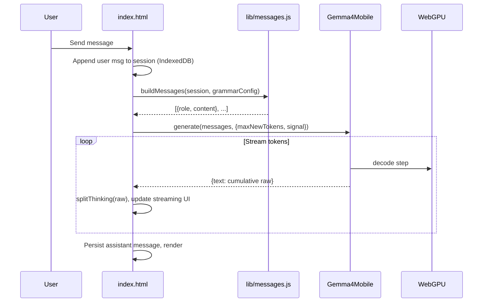
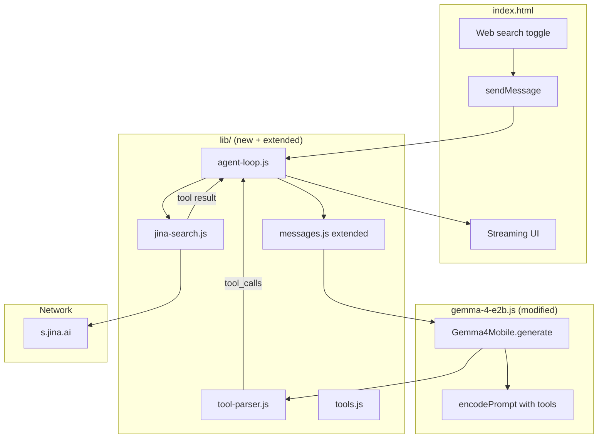

# WebLLM: Tool Calling + Jina Web Search — Design Spec (Expert Review)

**Document version:** 0.2 (post expert review)  
**Date:** 2026-07-10  
**Status:** Architecture approved in direction; **blocked on provider + runtime Phase 0** before UI work  
**Repository:** [WebLLM](https://github.com/jovanveljanoski/webllm) (static browser app, GitHub Pages)  
**Live demo:** https://jovanveljanoski.github.io/webllm/  
**App version at time of writing:** 0.0.5  

---

## 0. Purpose of this document

This spec describes a proposed feature: **optional web search via tool calling**, using **Jina Search** as the search backend, with a **minimal agentic loop** in the browser.

It is written for **external expert review**. We want feedback on:

- Correctness of the technical approach (especially Gemma 4 tool-call format + runtime constraints)
- Whether the agent loop design is sound
- Whether adopting [pi.dev](https://pi.dev)’s SDK/harness would be better than a custom loop
- Security, rate-limit, and UX pitfalls we may have missed
- Suggested corrections, alternatives, or simplifications

Please assume the reader has **not** seen the codebase. All critical context is included below.

---

## 1. Executive summary

### What we want

1. A new sidebar section **Tools** with a **Web search** toggle (**off by default**).
2. When enabled (and Gemma 4 E2B is loaded), the chat becomes **lightly agentic**:
   - User sends a message
   - Model may emit a `web_search` tool call
   - App executes search (Jina), feeds result back to model
   - Model may call search again (bounded) or reply with a final answer
3. **No backend, no API keys** — consistent with WebLLM’s “private browser chat” positioning.
4. **Scope v1:** one tool (`web_search`), one model family (Gemma 4 E2B), one search provider (Jina).

### What we are *not* proposing (v1)

- Full agent platform (bash, file tools, MCP, sub-agents)
- pi.dev / OpenClaw integration as a dependency
- LFM2.5 tool calling (different token format; unreliable at 230M–350M)
- User-supplied API keys (Jina optional key for higher limits is out of scope for v1)
- Server-side proxy

### Recommendation (current team view)

Build a **small custom agent loop in `lib/`**, inspired by pi’s event model but **without** importing `@earendil-works/pi-agent-core`. Prerequisite: extend the **Gemma runtime bundle** to accept `tools` in prompt rendering and preserve tool-call tokens during decode.

---

## 2. Product intent and constraints

### 2.1 What WebLLM is

WebLLM is a **static, frontend-only** chat demo:

- Runs LLM inference **in the browser** via **WebGPU**
- Downloads model weights from Hugging Face CDN (one-time; cached locally)
- Stores conversations in **IndexedDB** on the user’s device
- Hosted on **GitHub Pages** (no server)
- **No API keys**, no accounts, no telemetry backend

Tagline from README: *“A private AI chat that runs entirely in your browser — no server, no API keys, no data leaving your device.”*

**Important nuance for this feature:** enabling web search **does** send the search query (and receives results) to **Jina’s public API** over HTTPS. Inference still runs locally; only the tool step touches the network. UI copy should be honest about this.

### 2.2 Supported models (today)

| ID | Name | Size | Runtime file | Tool calling (model capability) | Proposed v1 support |
|----|------|------|--------------|--------------------------------|---------------------|
| `gemma4` | Gemma 4 E2B | ~2.5 GB | `gemma-4-e2b.js` | **Native** (special tokens + chat template) | **Yes** |
| `lfm2` | LFM2.5 230M | ~150 MB | `lfm2_5.js` | Native but different format | **No** (disable toggle) |
| `lfm2_350` | LFM2.5 350M | ~220 MB | `lfm2_5.js` | Same | **No** |

Default model: **Gemma 4 E2B** (`google/gemma-4-E2B-it-qat-mobile-transformers`).

### 2.3 Hard constraints

| Constraint | Implication |
|------------|-------------|
| GitHub Pages, static assets only | No server-side search proxy; `fetch()` from browser to Jina |
| No bundler in production | New logic lives in `lib/*.js` ES modules imported by `index.html` |
| WebGPU required | Tool loop runs on main thread; Jina fetch is async I/O |
| 2B quantized Gemma | Tool-call reliability lower than 12B; keep tool schema simple |
| Existing chat UX | Streaming, thinking traces, session persistence must keep working |

---

## 3. Current architecture (as-is)

### 3.1 Repository layout

```
webllm/
├── index.html              # App shell (~2500 lines): UI, state, load/generate wiring
├── lib/                    # Testable pure-ish JS modules
│   ├── messages.js         # buildMessages(), splitThinking(), export
│   ├── models.js           # MODELS registry
│   ├── sessions.js         # Session records, canSendToModel()
│   ├── prefs.js            # localStorage prefs serialize/parse
│   ├── generation.js       # Abort/error classification
│   ├── cache.js            # Model weight cache introspection
│   └── ...
├── gemma-4-e2b.js          # Minified WebGPU runtime (~5600 lines) → globalThis.Gemma4Mobile
├── lfm2_5.js               # Minified WebGPU runtime → Lfm2Mobile
├── tests/                  # Vitest unit tests (no real WebGPU)
└── research-e4b/           # Separate research track (E4B port); not production app
```

**Production deploy:** push to `master` → GitHub Pages. No build step.

### 3.2 Inference flow (today)



**Entry point in `index.html` (`sendMessage`):**

```javascript
const stream = state.model.generate(buildMessages(session), {
  maxNewTokens: state.maxNewTokens,
  signal: state.abort.signal,
});
for await (const { text: streamed } of stream) {
  raw = streamed;
  // ... update streaming UI via splitThinking(raw)
}
```

**Message builder (`lib/messages.js`) — only `user` / `assistant` / `system`:**

```javascript
export function buildMessages(session, grammarConfig) {
  const msgs = [];
  const sys = buildEffectiveSystemPrompt(session.systemPrompt, grammarConfig);
  if (sys) msgs.push({ role: "system", content: sys });
  for (const m of session.messages) {
    if (m.role === "user") msgs.push({ role: "user", content: m.content });
    else if (m.role === "assistant") msgs.push({ role: "assistant", content: m.content });
  }
  return msgs;
}
```

There is **no** tool role, **no** `tool_calls` on assistant messages, **no** tool definitions passed to the model.

### 3.3 Session record shape (IndexedDB)

Created in `lib/sessions.js`:

```javascript
{
  id: string,           // UUID
  title: string,
  systemPrompt: string,
  messages: [
    {
      role: "user" | "assistant",
      content: string,
      thinking?: string,     // assistant only, parsed from raw
      meta?: { tokens, tps, ttft }
    }
  ],
  modelId: "gemma4" | "lfm2" | "lfm2_350",
  createdAt: number,
  updatedAt: number,
}
```

Tool-call internals are **not** persisted today.

### 3.4 Preferences (`localStorage` key `webllm:prefs`)

```javascript
{
  activeSessionId,
  selectedModelId,
  grammarMode,        // "off" | "json" | "ebnf"
  maxNewTokens,
  grammarJsonSchema,
  grammarEbnf,
  sessionSearch,
  sidebarOpen: { conversations, system, model, settings, storage }
}
```

**Proposed addition:** `webSearchEnabled: false` (default).

### 3.5 Gemma runtime API (decompiled from `gemma-4-e2b.js`)

Public surface used by the app:

```javascript
// Loaded via script tag → globalThis.Gemma4Mobile
await Gemma4Mobile.load(null, {
  revision,      // pinned HF revision
  cacheName,     // e.g. "webllm-gemma4-v1"
  onProgress,
});
await state.model.warmup();

// Generation
async function* generate(messages, options = {}) {
  // options: maxNewTokens, eosTokenId, signal
  // yields: { token, delta, text }  where text is cumulative decoded string
}
state.model.reset();   // clear KV cache
state.model.dispose();
```

**Critical implementation detail (blocker):**

```javascript
encodePrompt(messages) {
  return this.#tokenizer.encode(
    this.#chatTemplate.render({
      messages,
      tools: null,              // ← HARDCODED: tools never passed
      bos_token: ...,
      eos_token: ...,
      add_generation_prompt: true,
      enable_thinking: true,    // ← thinking always on for Gemma
    }),
    { add_special_tokens: false }
  ).ids;
}

// During streaming decode:
this.#tokenizer.decode(tokens, { skip_special_tokens: true });  // ← strips <|tool_call|> markers
```

The **chat template Jinja** in model weights fully supports tools; the **runtime public API does not expose them**.

Tokenizer config (from bundled weights / `research-e4b/weights/e2b/tokenizer_config.json`) defines tool tokens:

| Token | String |
|-------|--------|
| Tool definition | `<\|tool>` … `<tool\|>` |
| Tool call | `<\|tool_call>` … `<tool_call\|>` |
| Tool response | `<\|tool_response>` … `<tool_response\|>` |

And a `response_schema` with regex parsers for `tool_calls` in model output.

### 3.6 Thinking + tool calls interaction

Gemma 4 E2B runs with `enable_thinking: true`. Model may emit:

```
<|channel>thought
...reasoning...
<channel|>
<|tool_call>call:web_search{query:<|"|>weather in Berlin<|"|>}<tool_call|>
```

The app already parses thinking via `splitThinking()` in `lib/messages.js`. Tool parsing must run on **raw decoded text** (before or coordinated with thinking split).

Reference: [Hugging Face Transformers.js Gemma 4 Browser Extension](https://huggingface.co/blog/transformersjs-chrome-extension) uses `extractToolCalls.ts` for this.

---

## 4. Problem statement

We want the model to answer questions requiring **up-to-date or external knowledge** while keeping inference local. The model alone cannot know today’s news, live weather, etc.

**Desired behavior:**

1. User: *“What happened in the news today about WebGPU?”*
2. Model decides it needs search → calls `web_search({ query: "..." })`
3. App fetches Jina results → injects as tool result
4. Model synthesizes a grounded answer citing search snippets

**Why tool calling (vs. naive RAG):**

- Model chooses **when** to search (saves latency on chit-chat)
- Model chooses **query formulation**
- Extensible pattern for future tools (weather, Wikipedia, …)

**Why not pi-web-access / Exa MCP (for v1):**

- [pi-web-access](https://github.com/nicobailon/pi-web-access) targets **Node.js Pi agent** (MCP, `gh` CLI, cookie auth)
- Exa MCP is viable from browser (CORS confirmed) but needs JSON-RPC client; Jina Search is a single GET
- WebLLM prioritizes **simplicity** for a first tool

---

## 5. Feature specification

### 5.1 User-facing requirements

| ID | Requirement |
|----|-------------|
| U1 | Sidebar section **“Tools”** with **“Web search”** toggle, default **OFF** |
| U2 | Toggle state persists in `localStorage` prefs |
| U3 | When OFF, behavior identical to today (single-pass chat) |
| U4 | When ON + Gemma 4 loaded, agent loop may run tool calls |
| U5 | When ON but LFM2 selected, toggle disabled or auto-off with explanation |
| U6 | User sees **visible indication** when search runs (e.g. “Searching the web…”) |
| U7 | Final assistant message readable; tool internals collapsed or summarized |
| U8 | **Stop** button aborts generation **and** in-flight Jina fetch |
| U9 | Honest disclosure: web search sends query to Jina (network) |

### 5.2 Functional requirements

| ID | Requirement |
|----|-------------|
| F1 | Exactly one tool in v1: `web_search` |
| F2 | Tool schema: `{ query: string }` (required) |
| F3 | Search via Jina: `https://s.jina.ai/{query}` |
| F4 | Max **3** tool iterations per user turn (configurable constant) |
| F5 | Max **1** search call per iteration (if model emits multiple, execute first valid or all sequential — **open question**, see §12) |
| F6 | Truncate Jina response before feeding model (default **8000** chars) |
| F7 | Handle Jina errors gracefully; pass error string as tool result so model can apologize |
| F8 | Rate limit (429): user-friendly toast, no crash |
| F9 | Agent loop integrates with existing `AbortController` |

### 5.3 Non-goals (v1)

- Persisting full tool-call transcript in IndexedDB (optional v1.1)
- OpenAI export including tool messages
- Multiple simultaneous tools
- Search result caching across sessions
- User Jina API key
- Grammar mode + tools simultaneously (likely **mutually exclusive** — open question)

---

## 6. Proposed architecture

### 6.1 High-level diagram



### 6.2 Design decision: custom loop vs pi.dev

We investigated [pi.dev](https://pi.dev) (`@earendil-works/pi-coding-agent`, `@earendil-works/pi-agent-core`).

| Aspect | pi.dev stack | WebLLM custom loop |
|--------|--------------|-------------------|
| Agent loop | Mature (`Agent`, events, tool execution) | ~100–150 lines to implement |
| LLM backend | HTTP providers via `pi-ai` | WebGPU `Gemma4Mobile.generate()` |
| Browser | Documented via `streamProxy` → **needs backend** | Native in-tab |
| Bundle | npm packages, needs bundler/tree-shaking | ES modules, no bundler |
| Message format | pi-ai unified schema | Gemma-specific tokens |
| OpenClaw precedent | Injects custom `streamFn` in Node | Would need full WebGPU adapter |

**Conclusion:** pi’s **event model** is the reference; **dependency is not justified** for one Jina tool. Revisit pi-agent-core if we add many tools or need compaction/steering.

### 6.3 New modules (proposed)

#### `lib/tools.js`

Tool registry and JSON Schema definitions (OpenAI function format — matches Gemma chat template).

```javascript
export const WEB_SEARCH_TOOL = {
  type: "function",
  function: {
    name: "web_search",
    description:
      "Search the web for current or factual information. Use when the user asks about recent events, " +
      "live data, or topics you are uncertain about. Do not use for pure reasoning or coding help.",
    parameters: {
      type: "object",
      properties: {
        query: {
          type: "string",
          description: "Concise search query, e.g. 'WebGPU Safari 2026 release'",
        },
      },
      required: ["query"],
    },
  },
};

export function activeTools({ webSearchEnabled }) {
  if (!webSearchEnabled) return [];
  return [WEB_SEARCH_TOOL];
}
```

#### `lib/jina-search.js`

```javascript
const JINA_SEARCH_BASE = "https://s.jina.ai/";
const DEFAULT_MAX_CHARS = 8000;

export async function jinaSearch(query, { signal, maxChars = DEFAULT_MAX_CHARS } = {}) {
  const q = String(query || "").trim();
  if (!q) throw new Error("Empty search query");

  // Jina accepts path-style query; encodeURIComponent is safe
  const url = JINA_SEARCH_BASE + encodeURIComponent(q).replace(/%20/g, "+");

  const res = await fetch(url, {
    signal,
    headers: {
      Accept: "text/plain, text/markdown, */*",
      // Optional v2: Accept: application/json for structured response
    },
  });

  if (res.status === 429) {
    throw new Error("Search rate limit exceeded. Try again in a minute.");
  }
  if (!res.ok) {
    throw new Error(`Search failed (${res.status})`);
  }

  let text = await res.text();
  if (text.length > maxChars) {
    text = text.slice(0, maxChars) + "\n\n[Results truncated for context limit]";
  }
  return text;
}
```

**Jina notes (from public docs + our research):**

- Free tier without API key: lower rate limits (anonymous IP)
- GitHub Pages users may share egress IP → faster 429s
- Latency often 2–15+ seconds
- Returns LLM-friendly markdown/plain text
- CORS: supported for browser `fetch`

#### `lib/tool-parser.js`

Gemma 4 output parser (port/adapt from Google docs + [gemma4-browser-extension](https://github.com/nico-martin/gemma4-browser-extension)).

**Expected model output format** ([Google Gemma 4 function calling guide](https://ai.google.dev/gemma/docs/capabilities/text/function-calling-gemma4)):

```
<|tool_call>call:get_current_temperature{location:<|"|>London<|"|>}<tool_call|>
```

**Proposed parser interface:**

```javascript
/**
 * @param {string} raw - Full cumulative decoded model output (special tokens preserved)
 * @returns {{ toolCalls: Array<{id,name,arguments}>, content: string, thinking: string }}
 */
export function parseGemma4Output(raw) {
  // 1. splitThinking(raw) — reuse lib/messages.js
  // 2. Regex extract all <|tool_call>call:NAME{ARGS}<tool_call|> blocks
  // 3. Parse ARGS: key:<|"|>value<|"|> pairs (Google's reference regex)
  // 4. Return toolCalls + remaining visible content
}
```

**Reference regex from Google docs:**

```javascript
function extractToolCalls(text) {
  function cast(v) {
    try { return JSON.parse(v); } catch {}
    try { return Number(v); } catch {}
    return { true: true, false: false }[v.toLowerCase()] ?? v.replace(/^['"]|['"]$/g, "");
  }
  return [{
    name,
    arguments: Object.fromEntries(
      [...args.matchAll(/(\w+):(?:<\|"\|>(.*?)<\|"\|>|([^,}]*))/gs)].map(m => [m[1], cast(m[2] || m[3])])
    ),
  } for [name, args] of text.matchAll(/<\|tool_call>call:(\w+)\{(.*?)\}<tool_call\|>/gs)];
}
```

**vLLM** also documents fallback patterns for malformed Gemma 4 output: [gemma4_utils](https://docs.vllm.ai/en/v0.22.0/api/vllm/tool_parsers/gemma4_utils/).

#### `lib/agent-loop.js`

Core loop (pi-inspired, no pi import):

```javascript
const MAX_TOOL_ITERATIONS = 3;

/**
 * @param {object} params
 * @param {object} params.model - Gemma4Mobile instance
 * @param {Array} params.messages - OpenAI-ish message list incl. tool turns
 * @param {Array} params.tools - Tool definitions
 * @param {number} params.maxNewTokens
 * @param {AbortSignal} params.signal
 * @param {function} params.onStream - ({ raw, phase, toolActivity }) => void
 * @param {Record<string, function>} params.executors - name → async (args, ctx) => result
 */
export async function runAgentTurn({ model, messages, tools, maxNewTokens, signal, onStream, executors }) {
  const working = [...messages];

  for (let iter = 0; iter < MAX_TOOL_ITERATIONS; iter++) {
    const raw = await generateToCompletion(model, working, { tools, maxNewTokens, signal, onStream });

    const { toolCalls, content, thinking } = parseGemma4Output(raw);

    if (!toolCalls.length) {
      return { content, thinking, raw, messages: working };
    }

    // Append assistant message with tool_calls (OpenAI format for chat template)
    const assistantMsg = {
      role: "assistant",
      content: content || "",
      tool_calls: toolCalls.map((tc, i) => ({
        id: `call_${iter}_${i}`,
        type: "function",
        function: { name: tc.name, arguments: tc.arguments },
      })),
    };
    working.push(assistantMsg);

    // Execute each tool (v1: sequential)
    for (const tc of assistantMsg.tool_calls) {
      onStream?.({ phase: "tool_start", toolName: tc.function.name, args: tc.function.arguments });
      let resultText;
      try {
        const exec = executors[tc.function.name];
        if (!exec) throw new Error(`Unknown tool: ${tc.function.name}`);
        resultText = await exec(tc.function.arguments, { signal });
      } catch (err) {
        resultText = `Error: ${err.message}`;
      }
      working.push({
        role: "tool",
        tool_call_id: tc.id,
        content: resultText,
      });
      onStream?.({ phase: "tool_end", toolName: tc.function.name });
    }

    // Loop continues → model sees tool results and may call again or answer
  }

  // Max iterations exceeded — return last state with user-visible note
  return {
    content: "(Search loop limit reached.)",
    thinking: "",
    raw: "",
    messages: working,
    truncated: true,
  };
}
```

**`generateToCompletion`:** wraps existing async generator, respects `signal`, optionally uses `skipSpecialTokens: false` when tools enabled.

### 6.4 Runtime changes (prerequisite)

**Option A — Preferred:** Upstream/runtime maintainer exposes:

```javascript
async function* generate(messages, options = {}) {
  // NEW options:
  //   tools: null | ToolDefinition[]
  //   skipSpecialTokens: boolean  (default true for backward compat)
  //   enableThinking: boolean     (optional override)
}
```

Internally:

```javascript
encodePrompt(messages, { tools, enableThinking }) {
  return this.#chatTemplate.render({ messages, tools, enable_thinking: enableThinking, ... });
}
// decode path uses skipSpecialTokens from options
```

**Option B — Local patch:** Edit minified `gemma-4-e2b.js` in-repo (fragile on runtime updates).

**Expert review ask:** Is there a cleaner hook (e.g. expose `renderPrompt` / `encodePrompt` publicly) without forking the whole bundle?

### 6.5 Extended message building

`lib/messages.js` gains:

```javascript
export function buildMessages(session, grammarConfig, { tools = [], agentTurn = null } = {}) {
  const msgs = [];
  const sys = buildEffectiveSystemPrompt(session.systemPrompt, grammarConfig);
  if (sys) msgs.push({ role: "system", content: sys });

  for (const m of session.messages) {
    if (m.role === "user") msgs.push({ role: "user", content: m.content });
    else if (m.role === "assistant") msgs.push({ role: "assistant", content: m.content });
  }

  // Ephemeral agent turn messages (tool calls/results) — NOT persisted in v1
  if (agentTurn?.ephemeral?.length) {
    msgs.push(...agentTurn.ephemeral);
  }

  return msgs;
}
```

**Chat template compatibility:** Gemma Jinja already supports:

- `tools` in system block (`<|tool>declaration:...<tool|>`)
- Assistant `tool_calls`
- Following `role: "tool"` messages with `tool_call_id`

(See `research-e4b/weights/e2b/chat_template.jinja`.)

### 6.6 `index.html` integration sketch

```javascript
async function sendMessage() {
  // ... existing validation ...

  const webSearchOn = state.webSearchEnabled && state.loadedModelId === "gemma4";

  if (!webSearchOn) {
    await runSinglePassGeneration(session);  // today's path
    return;
  }

  const executors = {
    web_search: (args, ctx) => jinaSearch(args.query, { signal: ctx.signal }),
  };

  await runAgentTurn({
    model: state.model,
    messages: buildMessages(session, grammarConfig(), {
      tools: activeTools({ webSearchEnabled: true }),
    }),
    tools: activeTools({ webSearchEnabled: true }),
    maxNewTokens: state.maxNewTokens,
    signal: state.abort.signal,
    executors,
    onStream: ({ raw, phase, toolName }) => {
      if (phase === "tool_start") showToolStatus(`Searching: ${toolName}…`);
      else updateStreamingRaw(raw);
    },
  });
}
```

---

## 7. UI specification

### 7.1 Sidebar — new “Tools” block

Insert after **Model**, before **System prompt**:

```html
<details class="side-block" id="tools-block">
  <summary>Tools</summary>
  <div class="side-block-body">
    <label class="toggle-row">
      <input type="checkbox" id="web-search-toggle">
      <span>Web search</span>
    </label>
    <p class="field-hint" id="web-search-hint">
      Lets Gemma 4 search the web via Jina when needed. Requires network access.
      Gemma 4 E2B only.
    </p>
  </div>
</details>
```

**States:**

| Condition | Toggle |
|-----------|--------|
| Gemma 4 not loaded | Disabled + hint “Load Gemma 4 E2B first” |
| LFM2 selected | Disabled + hint “Web search requires Gemma 4 E2B” |
| Gemma 4 loaded | Enabled |

Persist: `webSearchEnabled` in prefs; add `tools` to `sidebarOpen` map.

### 7.2 Chat UI during tool use

Minimal pi-like feedback (not full pi curator):

1. **Streaming assistant bubble** (as today)
2. **Tool status chip** below bubble or in footer: `Searching the web…` / `Search complete`
3. Optional collapsible **“Tool activity”** disclosure (query used, result length) — v1.1

Do **not** dump raw Jina markdown into the visible chat bubble; only the model’s final synthesized answer.

### 7.3 Disclosure

Add to Tools hint or Credits dialog:

> Web search sends your query to [Jina Search](https://jina.ai/reader/) (HTTPS). Model inference still runs locally on your device.

---

## 8. Gemma 4 tool calling — technical reference

### 8.1 Prompt layout (with tools)

From Google’s docs, after `apply_chat_template` with tools:

```
<bos><|turn>system
<|think|>
You are a helpful assistant.
<|tool>declaration:web_search{description:<|"|>...<|"|>,parameters:{...}}<tool|><turn|>
<|turn>user
What's the weather in Berlin?<turn|>
<|turn>model
```

Model may respond:

```
<|tool_call>call:web_search{query:<|"|>weather Berlin today<|"|>}<tool_call|>
```

Developer appends (via chat template):

```
<|tool_response>response:web_search{value:<|"|>...jina markdown...<|"|>}<tool_response|>
```

Then model continues generation for final answer.

### 8.2 Model capability vs runtime gap

| Layer | Tool support |
|-------|--------------|
| HF model card / tokenizer | ✅ |
| `chat_template.jinja` in weights | ✅ |
| `gemma-4-e2b.js` encodePrompt | ❌ `tools: null` |
| `gemma-4-e2b.js` decode | ❌ `skip_special_tokens: true` |
| WebLLM app | ❌ no agent loop |

### 8.3 Reliability expectations (2B QAT)

Third-party benchmarks (anecdotal, not official Google):

- ~70–95% function-calling accuracy on **simple** single-tool schemas
- Degrades with ambiguous prompts, many tools, overlapping descriptions
- MindStudio guidance: keep **≤6 tools**, clear descriptions; E4B/12B better for complex schemas

**v1 mitigations:**

- Only one tool
- Explicit description when to use / not use
- Optional system prompt append when tools enabled: *“You have web_search. Use it for current events only.”*

---

## 9. Jina Search — integration details

### 9.1 API

| | |
|--|--|
| Search URL | `GET https://s.jina.ai/{query}` |
| Reader (not v1) | `GET https://r.jina.ai/{url}` — fetch page content |
| Auth | None required (anonymous tier) |
| CORS | Documented for browser use |
| Output | Plain text / markdown |

### 9.2 Example

```javascript
const res = await fetch("https://s.jina.ai/WebGPU+browser+2026", { signal });
const markdown = await res.text();
```

### 9.3 Error handling matrix

| Condition | App behavior |
|-----------|--------------|
| Network offline | Tool result: `"Error: Network unavailable"` |
| HTTP 429 | Toast + tool result with rate-limit message |
| HTTP 5xx | Retry once (optional), then error to model |
| Timeout (30s) | Abort via `AbortSignal` |
| Empty query | Reject before fetch |

### 9.4 Security

- **SSRF:** Not applicable (user doesn’t pass URL to Jina reader in v1)
- **Prompt injection via search results:** Jina content is untrusted; wrap in tool result; system prompt should say tool output is untrusted data
- **Query leakage:** User’s search query leaves device — disclose in UI

---

## 10. LFM2.5 — why excluded from v1

LFM2 uses a **different** tool format:

```
<|tool_call_start|>[get_weather(location="Paris")]<|tool_call_end|>
```

Liquid AI docs: https://docs.liquid.ai/lfm/key-concepts/tool-use

Would require:

- Separate parser
- Different chat template wiring in `lfm2_5.js`
- Lower reliability at 230M–350M parameters

**Proposal:** `supportsTools: true` flag only on `gemma4` in `MODELS`; UI gates toggle.

---

## 11. pi.dev investigation summary (for experts)

### 11.1 What pi is

- Open-source **Node.js** agent stack by Mario Zechner ([@badlogicgames](https://x.com/badlogicgames))
- Packages: `pi-ai`, `pi-agent-core`, `pi-coding-agent`, `pi-tui`
- [OpenClaw](https://github.com/openclaw/openclaw) embeds pi via `createAgentSession()` with custom tools and `streamFn` overrides

### 11.2 Why we did not choose pi for v1

1. **LLM transport:** pi-ai speaks HTTP to cloud providers; WebLLM uses in-process WebGPU
2. **Browser:** pi documents `streamProxy` for browser → backend; we have no backend
3. **Bundle size / build:** pi is npm-first; WebLLM is static ES modules without bundler
4. **Adapter cost:** Custom `streamFn` bridging Gemma tokens ↔ pi-ai messages ≈ same effort as small custom loop
5. **Scope:** pi-coding-agent brings bash/read/write/session filesystem — irrelevant

### 11.3 What we borrow from pi

Event sequence for UI:

```
agent_start → turn → stream → tool_execution_* → turn → … → agent_end
```

OpenClaw pattern for custom providers:

```typescript
if (providerStreamFn) {
  activeSession.agent.streamFn = providerStreamFn;
}
```

We would need an equivalent **`streamFn` → `Gemma4Mobile.generate()`** adapter to use pi-agent-core — feasible in a **future v2** if tool count grows.

---

## 12. Open questions (explicit asks for reviewers)

1. **Runtime API:** Best way to expose `tools` + `skipSpecialTokens` on `Gemma4Mobile` without fragile minified patches? Upstream PR vs local wrapper class?

2. **KV cache across agent iterations:** When `messages` array grows with tool results, does the runtime’s prefix cache (`Gp(this.#u, s)` in decompiled code) correctly reuse prefix? Need to verify no stale cache bugs across multi-pass turns.

3. **Multiple tool calls in one assistant message:** Should v1 execute all, or only the first? Gemma may emit one search at a time typically.

4. **Grammar mode + tools:** Should grammar (JSON/EBNF) be disabled when web search is on? Likely yes — conflicting output constraints.

5. **Persistence:** Should we store `toolTrace` on assistant messages for debugging/transparency, or keep ephemeral?

6. **Export format:** Extend OpenAI export to include tool calls, or keep user-facing export clean?

7. **Jina vs Exa MCP:** For browser-only, is Jina sufficient or should we plan Exa MCP (CORS OK, richer results, more complex client)?

8. **Parser robustness:** Which fallback patterns from vLLM `gemma4_utils` are essential for 2B QAT output?

9. **Thinking + tool call ordering:** Can tool calls appear *before* `<channel|>` closes? Parser order: thinking first, then tools, then content?

10. **Max iterations = 3:** Reasonable default for UX/latency?

---

## 13. Risks and mitigations

| Risk | Impact | Mitigation |
|------|--------|------------|
| Runtime patch fragility | Breaks on bundle update | Prefer upstream API; document patch points |
| Jina 429 on GitHub Pages | Search fails often | Clear UX; optional backoff; document limits |
| Slow turns (search + 2–3 generates) | Poor UX | Show progress; set iteration cap |
| Model doesn’t call tool when needed | Wrong/hallucinated answer | System prompt tuning; future: suggest “try enabling search” |
| Model calls tool unnecessarily | Latency | Tool description tuning |
| Large Jina payload | Context overflow / OOM | Aggressive truncation (8K chars) |
| `skip_special_tokens` oversight | Parser never sees tool calls | Integration test with fixture strings |
| Legal/ToS | Jina terms | Link to Jina docs; no scraping abuse |

---

## 14. Testing strategy

### 14.1 Unit tests (Vitest, no WebGPU)

| Module | Tests |
|--------|-------|
| `tool-parser.js` | Fixture strings → expected toolCalls; thinking coexistence; malformed output |
| `jina-search.js` | Mock `fetch`; truncation; 429 handling |
| `agent-loop.js` | Mock model that returns tool call then final answer; iteration cap; abort |
| `tools.js` | Schema shape |
| `messages.js` | buildMessages with ephemeral tool messages |

Example parser fixture:

```javascript
const FIXTURE = `<|channel>thought
User wants recent news. I should search.
<channel|>
<|tool_call>call:web_search{query:<|"|>WebGPU news July 2026<|"|>}<tool_call|>`;

expect(parseGemma4Output(FIXTURE).toolCalls).toEqual([
  { name: "web_search", arguments: { query: "WebGPU news July 2026" } },
]);
```

### 14.2 Manual smoke tests (HTTPS + WebGPU)

1. Toggle off → ordinary chat unchanged
2. Toggle on → “What is the weather in Tokyo?” → search chip → grounded answer
3. Stop during Jina fetch → abort clean
4. LFM2 selected → toggle disabled
5. Offline → graceful error

### 14.3 Out of scope for CI

Real WebGPU inference, real Jina calls (network flaky).

---

## 15. Implementation phases

### Phase 0 — Runtime (blocker)

- [ ] Expose `tools` + `skipSpecialTokens` on `Gemma4Mobile.generate()` / `encodePrompt`
- [ ] Manual verify: model emits `<|tool_call>…` in decoded output when tools passed

### Phase 1 — Core library

- [ ] `lib/tools.js`
- [ ] `lib/jina-search.js`
- [ ] `lib/tool-parser.js` + tests
- [ ] `lib/agent-loop.js` + tests
- [ ] Extend `lib/messages.js`, `lib/prefs.js`

### Phase 2 — UI

- [ ] Sidebar Tools section + prefs wiring
- [ ] `sendMessage()` branch: single-pass vs agent loop
- [ ] Tool activity UI + streaming integration
- [ ] Model gating (Gemma only)

### Phase 3 — Polish

- [ ] Disclosure copy, 429 toasts
- [ ] README update
- [ ] Optional: `supportsTools` in `MODELS` registry

### Phase 4 (future)

- [ ] pi-agent-core evaluation if adding 3+ tools
- [ ] LFM2 parser if small-model tools desired
- [ ] Persist tool traces; export format
- [ ] Jina Reader for `fetch_url` tool

---

## 16. Alternatives considered

| Alternative | Pros | Cons | Verdict |
|-------------|------|------|---------|
| **Jina Search tool (proposed)** | Simple GET, no key, CORS | Rate limits, less control | ✅ v1 choice |
| **Exa MCP (`mcp.exa.ai`)** | pi-web-access zero-config path, quality | JSON-RPC client, 429, complexity | v2 candidate |
| **DuckDuckGo Instant Answer** | Simple API | Not real web search | ❌ |
| **Pre-search always (RAG)** | Simpler loop | Wastes latency; bad queries | ❌ |
| **User paste URL + Jina Reader** | No search API | Extra UX friction | Future tool |
| **Full pi-coding-agent SDK** | Mature loop | Node, HTTP LLMs, bundler | ❌ v1 |
| **pi-agent-core only** | Good loop | Heavy adapter for WebGPU | ⚠️ v2 |

---

## 17. References

### Project

- WebLLM repo README: `README.md`
- Live app: https://jovanveljanoski.github.io/webllm/
- Model hub: `google/gemma-4-E2B-it-qat-mobile-transformers`
- Runtime: `gemma-4-e2b.js` (Transformers.js / webml-community bundle)

### Gemma tool calling

- [Function calling with Gemma 4 (Google)](https://ai.google.dev/gemma/docs/capabilities/text/function-calling-gemma4)
- [Transformers.js Gemma 4 Browser Extension blog](https://huggingface.co/blog/transformersjs-chrome-extension)
- [gemma4-browser-extension / extractToolCalls.ts](https://github.com/nico-martin/gemma4-browser-extension/blob/main/src/background/agent/extractToolCalls.ts)
- [vLLM gemma4_utils parser](https://docs.vllm.ai/en/v0.22.0/api/vllm/tool_parsers/gemma4_utils/)
- Chat template: `research-e4b/weights/e2b/chat_template.jinja`
- Tokenizer config: `research-e4b/weights/e2b/tokenizer_config.json`

### Jina

- [Jina Reader / Search](https://jina.ai/reader/)
- [jina-ai/reader GitHub](https://github.com/jina-ai/reader)
- Search endpoint: `https://s.jina.ai/{query}`

### pi.dev / agents

- [pi.dev](https://pi.dev/)
- [pi SDK docs (createAgentSession)](https://github.com/earendil-works/pi/blob/main/packages/coding-agent/docs/sdk.md)
- [pi-agent-core README](https://github.com/earendil-works/pi/blob/main/packages/agent/README.md)
- [OpenClaw pi integration](https://docs2.openclaw.ai/pi)
- [pi-web-access](https://github.com/nicobailon/pi-web-access) (Node agent web search extension — inspiration, not direct port)

### LFM2 tools (out of v1 scope)

- [Liquid AI — Tool Use](https://docs.liquid.ai/lfm/key-concepts/tool-use)

---

## 18. Summary for reviewers

**We want to add optional web search to a browser-only WebGPU chat app** using Gemma 4’s native function calling and Jina Search as a free HTTPS backend.

**The main technical blockers are:**

1. Gemma runtime hardcodes `tools: null` and strips special tokens on decode.
2. The app has no agent loop — only single-pass `generate()`.

**Our proposal:**

- Patch/runtime-extend Gemma4Mobile for tools
- Implement ~4 small `lib/` modules (parser, Jina client, agent loop, tool defs)
- Add a sidebar toggle (off by default), Gemma-only
- Do **not** adopt pi.dev as a dependency for v1; borrow its loop semantics only

**We would especially value expert feedback on:**

- Runtime integration approach
- Parser/caching correctness for multi-turn tool loops on Gemma 4 E2B QAT
- Whether pi-agent-core with a custom `streamFn` is worth it sooner
- Jina vs alternatives for production-ish browser demos
- Any spec gaps or incorrect assumptions about Gemma 4 tool format

---

## 19. Expert review response (2026-07-10)

External review received. This section records our independent verification, what we accept, what we push back on, and the **revised implementation plan**.

### 19.1 Reviewer verdict (accepted)

> Approve custom agent loop direction; **do not implement unchanged**. Resolve provider choice and Gemma runtime contract in Phase 0 with integration tests before UI.

We agree.

### 19.2 Validation matrix

| # | Reviewer finding | Our verification | Verdict |
|---|------------------|------------------|---------|
| P0 | Jina Search requires API key; no-key blocked | `curl https://s.jina.ai/WebGPU` → **401**. [Jina pricing table](https://jina.ai/reader/) lists `s.jina.ai` as **block** without key. `r.jina.ai` → **200** (Reader still keyless). | **Valid — spec blocker** |
| P0 | Must retain `reasoning` in assistant messages during tool turn | Chat template re-renders `reasoning`/`reasoning_content` before `tool_calls` (lines 238–241). [Google Gemma 4 prompt docs](https://ai.google.dev/gemma/docs/core/prompt-formatting-gemma4): thoughts must NOT be stripped between function calls in same turn. | **Valid** |
| P0 | Tool-aware stopping required (`<|tool_response>` boundary) | Google example ends generation at `<|tool_call|><|tool_response>`. Decode-only fix is insufficient. | **Valid** |
| P0 | Generic `cast()` turns query strings into `NaN` | `Number("WebGPU news")` → `NaN` without throw in JS. | **Valid — our spec bug** |
| P0 | `m[2] \|\| m[3]` breaks empty strings | Logical OR falls through on `""`. Should use `??`. | **Valid** |
| P0 | Loop cap allows N searches without final synthesis | 3 tool iterations = 3 searches, exit without answer generation. | **Valid** |
| P0 | User abort must not become tool error | Catching all errors and feeding model would continue after Stop. | **Valid** |
| — | GitHub Pages shared egress IP | Browser `fetch()` uses **user's network**, not GH Pages infrastructure. | **Valid correction of our spec** |
| — | Exa MCP as no-key search candidate | `POST https://mcp.exa.ai/mcp` initialize succeeds without key; CORS preflight **204**. | **Valid — spike passed** |
| — | Use provider abstraction, not hardcoded Jina | — | **Valid** |
| — | Separate search budget vs generation count | — | **Valid** |
| — | Grammar mode ⊥ tools | Conflicting output constraints. | **Valid** |
| — | Structured bounded search results + citation labels | Better than 8K raw markdown substring. | **Valid (recommended)** |
| — | Sanitize Gemma control tokens in external text | Real injection/tokenization risk. | **Valid** |
| — | Persist minimal `toolTrace`, not full raw payload | — | **Valid (revision of our v1 ephemeral stance)** |
| — | KV cache: reset between iterations until proven | Conservative; correct for v1. | **Valid** |
| — | Parser: no execute on truncated/in-thought calls | Aligns with pi loop safety. | **Valid** |
| — | One search per model step; explicit skip results for extras | — | **Valid** |
| — | `webSearchPreferred` vs `webSearchEffective` | — | **Valid UX** |
| — | pi.dev: architecturally adaptable, operationally mismatched | Node 22 engine, npm/bundler path; not “impossible in browser.” | **Partially valid — we overstated, conclusion stands** |
| — | “100–150 lines” underestimate | Full production loop + tests is larger. | **Valid** |
| — | Upstream runtime PR strongly preferred over hand-editing minified bundle | — | **Valid preference** (patch script acceptable interim) |

**Nothing in the review appears invalid or materially wrong.** Several items are stricter than we would have shipped (structured results, control-token sanitization, prompt-render tests) but are technically sound.

### 19.3 Revised product constraints

| Constraint | v0.1 spec | v0.2 (revised) |
|------------|-----------|----------------|
| Search provider | Jina Search, no key | **Provider TBD after spike; default target: Exa MCP (no key)** |
| Jina | Primary | **Search: blocked without key.** Reader (`r.jina.ai`) remains option for future `fetch_url` tool |
| API keys | None | **None required for default path**; optional BYOK (Jina/Exa) deferred to v2 |
| Tagline | “No data leaving device” when tools off | Add: *“Private by default. Optional web tools send limited data to third-party services.”* |
| Tool result persistence | Ephemeral in v1 | **Minimal `toolTrace` metadata** persisted on assistant message |
| Grammar + tools | Open question | **Mutually exclusive** |

### 19.4 Revised architecture

**Provider interface (new):**

```javascript
/** @typedef {{ id: string, title: string, url: string, snippet: string, publishedAt?: string|null }} SearchResult */

export class SearchProvider {
  /** @returns {Promise<SearchResult[]>} */
  async search(query, { signal, maxResults = 5, maxTotalChars = 6000 }) {
    throw new Error("not implemented");
  }
}
```

**Implementations to spike (Phase 0):**

1. **ExaMcpSearchProvider** — JSON-RPC to `https://mcp.exa.ai/mcp`, tool `web_search_exa` (preferred for no-key)
2. **JinaSearchProvider** — requires `Authorization: Bearer …` (BYOK only, or drop for v1)
3. *(Future)* Jina Reader for URL fetch, not SERP

**Runtime API (revised):**

```javascript
async function* generate(messages, {
  maxNewTokens, signal, eosTokenId,
  tools = null,
  enableThinking = true,
  preserveControlTokens = false,  // raw stream for parser
  stopOnToolCall = false,         // stop after complete tool_call block
  stopTokenIds = [],
} = {})
// yields: { token, delta, text, rawDelta?, rawText?, stopReason? }
```

**Agent loop budgets (revised):**

```javascript
const MAX_SEARCH_CALLS = 3;           // hard cap per user turn
const TARGET_SEARCH_CALLS = 1;        // UX expectation
const MAX_MODEL_GENERATIONS = MAX_SEARCH_CALLS + 1;  // always reserve synthesis pass
```

**Assistant message during tool turn (revised):**

```javascript
{
  role: "assistant",
  content: parsed.content || "",
  reasoning: parsed.thinking || undefined,  // REQUIRED for template
  tool_calls: [...]
}
```

**Parser (revised):** single-function `web_search` grammar only; no generic `cast()`. Reject calls inside unclosed thought channel or incomplete delimiters.

### 19.5 Revised phases (do not start UI until Phase 0 complete)

#### Phase 0 — Provider + runtime contract (BLOCKING)

- [ ] Exa MCP browser spike from deployed origin: CORS, `initialize`, `tools/list`, `tools/call`, abort, 429
- [ ] Implement `SearchProvider` interface + Exa backend (or document fallback if spike fails)
- [ ] Upstream/patch runtime: tools, reasoning in prompt, tool-aware stop, raw/clean decode channels
- [ ] Prompt-render snapshot tests (tools in system block, reasoning before tool_calls, tool role rendering)
- [ ] Manual: model emits stoppable tool call on Gemma 4 E2B

#### Phase 1 — Agent core (`lib/`)

- [ ] `lib/search-provider.js` (interface + Exa)
- [ ] `lib/tool-parser.js` (strict web_search parser + safety rules)
- [ ] `lib/agent-loop.js` (revised loop from review §13)
- [ ] `lib/sanitize.js` (control-token neutralization in external text)
- [ ] `lib/tools.js` (schema with `additionalProperties: false`)
- [ ] Vitest: parser, loop, abort, iteration budgets, malformed calls

#### Phase 2 — App integration + UI

- [ ] Sidebar Tools toggle (`webSearchPreferred` / `webSearchEffective`)
- [ ] Grammar/tool mutual exclusion
- [ ] Tool activity UI (show query, source count)
- [ ] Revised privacy disclosure
- [ ] Minimal `toolTrace` on persisted assistant messages

#### Phase 3 — Polish

- [ ] Optional BYOK provider config (if desired)
- [ ] KV cache reuse optimization (after prefix tests)
- [ ] Full-agent export (advanced, not default)

### 19.6 Open decisions (post-review)

1. **If Exa MCP spike fails in browser** (rate limit, MCP session complexity, CORS on `tools/call`): fallback options are BYOK Jina, Cloudflare Worker proxy, or ship feature disabled.
2. **Whether v1 ships with 1 or 2 as normal search target** (reviewer suggests 2 soft max; we lean 1 for latency on 2B model).
3. **Upstream runtime**: who owns PR to webml-community bundle vs local patch script.

---

## 20. Second expert review — comparison and reconciliation (2026-07-10)

A second reviewer provided feedback. This section compares both reviews, re-runs disputed claims, and records the **reconciled plan**.

### 20.1 Independent re-checks (disputed items)

| Claim | Reviewer A (first) | Reviewer B (second) | Our verification (2026-07-10) |
|-------|-------------------|---------------------|-------------------------------|
| Jina Search without API key | **Blocked** (401) | **"Right for v1"**, no key needed | `curl s.jina.ai` → **401**. [Jina docs](https://jina.ai/reader/) list `s.jina.ai` as **block** without key. **A correct, B wrong.** |
| Exa MCP without API key | Recommended | "API key likely" | `initialize` → 200; `tools/list` → `web_search_exa`; `tools/call` → **real results, no key**. **A correct, B wrong.** |
| GitHub Pages shared egress IP | User IP, not GH Pages | Repeats shared GH Pages IP concern | Browser `fetch` uses **client network**. **A correct, B wrong** (repeats our original mistake). |
| `generate(stringPrompt)` bypass | Not proposed | **"Fastest de-risk path"** | Decompiled runtime: `generate(n)` always calls `encodePrompt(n)` which passes `n` as `messages` to Jinja. **No string overload.** String bypass **does not work** without a separate encode API. **B's Phase 0 priority is a dead end** (quick negative test only). |
| Runtime integration | Upstream PR > patch script | Wrapper / prototype patch, avoid editing minified file | Both viable interim. Prototype patch still needs access to template+tokenizer (private fields) OR duplicate Jinja render using bundled `chat_template.jinja`. **Merge: upstream PR preferred; prototype patch or reproducible patch script as interim.** |
| Multiple tool calls per step | One search executed; explicit skip results for extras | Execute all sequentially | For single-tool v1, both often identical. **Reconcile: execute first search only per generation step; append explicit skip/error results for additional calls** (A), to enforce budget and avoid duplicate queries. |
| Tool trace persistence | Minimal metadata persist | Do not persist v1 | **Reconcile: persist minimal metadata only** (query, provider, source titles/URLs, timing, status) — not full raw provider payload. Addresses B's size concern and A's debug needs. |
| Parser `cast()` function | Reject; strict web_search grammar | Keep with regex improvements | **`cast()` is unsafe** (`Number("text")` → NaN). **Follow A.** Adopt B's optional `(?:call:)?` prefix in strict parser. **Do not execute** calls with missing `</tool_call|>` (A over B on malformed fallback). |
| Loop iteration cap | `MAX_SEARCH_CALLS + 1` generations | 3 iterations OK | **Follow A** — avoid ending after N searches without synthesis pass. |
| Force `/search` override | Not mentioned | Nice v1.1 idea | **Accepted as future enhancement**, not v1. |

### 20.2 Where both reviewers agree

- Custom agent loop (not pi.dev) for v1 ✅
- Gemma 4 E2B only for tool calling v1 ✅
- Grammar mode and tools mutually exclusive ✅
- Abort must propagate to both generate and search fetch ✅
- Thinking before tool calls; don't execute calls inside unclosed thought channel ✅
- System prompt guard for untrusted tool output ✅
- KV cache behavior unknown — measure TTFT; reset if uncertain ✅
- Scope is well bounded — do not expand v1 ✅
- Runtime `tools: null` + decode stripping are real blockers ✅

### 20.3 Reconciled verdict

| Area | Decision |
|------|----------|
| **Architecture** | Proceed with custom loop |
| **Search provider** | **Exa MCP** (no-key default). Jina Search **not viable** without user API key. Jina Reader optional later for `fetch_url`. |
| **Runtime** | Upstream API (`tools`, `reasoning`, tool-aware stop, raw/clean channels). Interim: reproducible patch or init-time hook — **not** string-prompt bypass. |
| **Parser** | Strict `web_search` grammar; optional `(?:call:)?`; no generic `cast()`; no execute on truncated calls |
| **Loop budgets** | `MAX_SEARCH_CALLS = 3`, `MAX_MODEL_GENERATIONS = MAX_SEARCH_CALLS + 1` |
| **Persistence** | Minimal `toolTrace` metadata on assistant messages |
| **UI** | Block until Phase 0 (provider + runtime) passes tests |

### 20.4 Revised Phase 0 (after both reviews)

| Step | Action | Outcome |
|------|--------|---------|
| 0a | ~~Verify string prompt to `generate()`~~ | **Done: fails.** Always routes through `encodePrompt(messages)`. |
| 0b | Exa MCP browser spike: `initialize`, `tools/list`, `tools/call`, abort, 429 from target origin | Server-side curl passed; **browser-origin test still required** |
| 0c | Runtime contract: tools in template, reasoning retention, tool-aware stop, dual decode streams | Blocking |
| 0d | Prompt-render snapshot tests | Blocking |

### 20.5 Acknowledged good ideas from Reviewer B only

- Prototype/wrapper patch as **interim** (not minified hand-edit) — merge with A's upstream preference
- Parser test fixtures: malformed, multi-call, no-call cases
- Performance note: measure TTFT across agent iterations
- Optional `/search` force override (v1.1)
- System prompt as #1 lever for 2B tool-call reliability (~85% expectation with tuning)

---

*End of document.*
